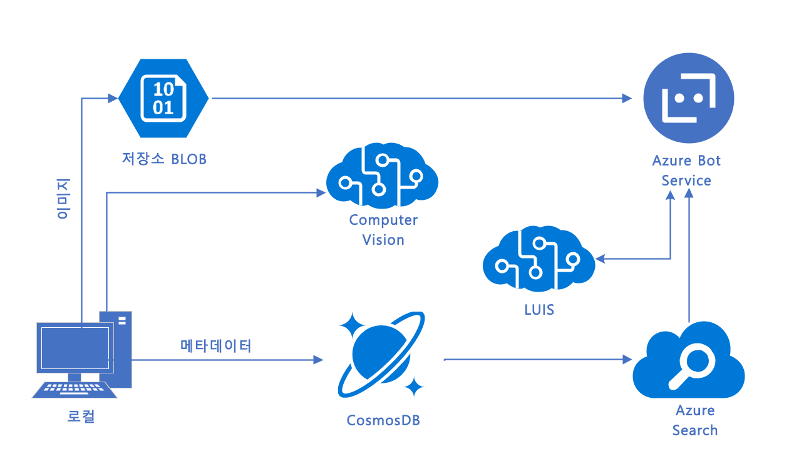
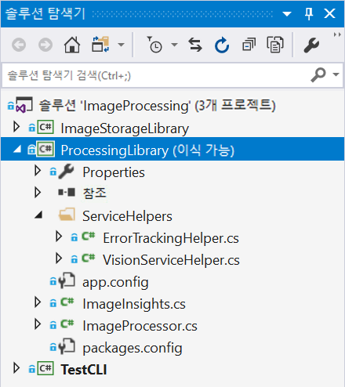

# 랩 2 - Computer Vision 구현

## 소개

사진을 가져오고 Cognitive Services를 사용하여 이미지에 대한 캡션 및 태그를 얻을 수 있는 종단 간 응용 프로그램을 빌드할 것입니다. 이후 랩에서는 이러한 이미지에 대한 쉬운 대상 쿼리가 가능하도록 LUIS를 사용해 Bot Framework 봇을 빌드합니다.

## 랩 2.0: 목표

이 랩에서는 다음 작업을 수행합니다.

- 다양한 Cognitive Services API 파악
- Cognitive Services를 호출하도록 앱을 구성하는 방법 이해
- .NET 응용 프로그램에서 다양한 Cognitive Services API(특히 Computer Vision)를 호출하는 응용 프로그램 빌드

Cognitive Services에 중점을 두고 있지만 Visual Studio 2019도 활용할 수 있습니다.

> **참고** 아직 없는 경우 Azure 계정, Cognitive Services를 만들고 [Lab1-Technical_Requirements.md](../Lab1-Technical_Requirements/02-Technical_Requirements.md)에서 api 키를 가져오는 방법에 대한 지침을 따르십시오.

## 랩 2.1: 아키텍처

로컬 드라이브에서 사진을 수집한 다음 [Computer Vision API](https://www.microsoft.com/cognitive-services/ko-kr/computer-vision-api)를 호출하여 이미지를 분석하고 태그 및 설명을 얻을 수 있는 단순한 C# 응용 프로그램을 빌드합니다.

랩 전반에 걸쳐 이 랩에서 계속하여 데이터를 쿼리하는 방법을 설명한 후 데이터를 쿼리하는 [Bot Framework](https://dev.botframework.com/) 봇을 빌드하겠습니다. 마지막으로, 쿼리에서 의도를 자동으로 도출하고 이를 바탕으로 지능적으로 검색을 수행하도록 [LUIS](https://www.microsoft.com/cognitive-services/ko-kr/language-understanding-intelligent-service-luis)를 사용하여 이 봇을 확장하겠습니다.



## 랩 2.2: 리소스

[main](https://github.com/MicrosoftLearning/AI-100KO-Design-Implement-Azure-AISol/blob/master/Lab2-Implement_Computer_Vision/) github 리포지토리 폴더에는 다음과 같은 몇 개의 디렉터리가 있습니다.

- **sample_images**: Cognitive Services 구현을 테스트하는 데 사용할 일부 샘플 이미지입니다.

- **code**: 여기에는 두 개의 디렉터리가 있습니다. 각 폴더에는 랩의 여러 가지 프로젝트가 들어 있는 솔루션(.sln)이 포함되어 있습니다.

  - **Starter**: 시작 프로젝트입니다. 프로젝트에서 사용되는 코드를 만드는 방법에 대해 배울 수 있습니다.

  - **Finished**: 컴퓨터 비전을 구현하고 이 랩의 이미지와 함께 작업하는 데 사용할 완성된 프로젝트입니다.

## 랩 2.3: 이미지 처리

### Cognitive Services

Cognitive Services를 사용하면 자연스러운 커뮤니케이션 방법을 통해 사용자의 요구를 보고, 듣고, 말하고, 이해하고, 해석하는 알고리즘을 앱, 웹 사이트 및 봇에 주입할 수 있습니다.

사용 가능한 Cognitive Services에는 크게 다음과 같은 5가지 범주가 있습니다.

- **비전**: 사진을 식별하고 캡션을 추가하며 조정하는 이미지 처리 알고리즘
- **지식**: 지능형 권장 사항 및 의미 체계 검색 같은 작업을 해결하기 위해 복잡한 정보와 데이터를 매핑합니다.
- **언어**: 앱이 미리 빌드된 스크립트로 자연어를 처리하고, 감정을 평가하고, 사용자가 원하는 것을 인식하는 방법을 학습할 수 있도록 합니다.
- **음성**: 음성 오디오를 텍스트로 변환하거나, 음성을 사용하여 정보를 확인하거나, 앱에 화자 인식을 추가합니다.
- **검색**: Bing Search API를 앱에 추가하고 단일 API 호출로 수십억 개의 웹 페이지, 이미지, 비디오 및 뉴스를 검색하는 기능을 활용합니다.

[서비스 디렉터리](https://azure.microsoft.com/ko-kr/services/cognitive-services/directory/)에서 모든 특정 API를 찾을 수 있습니다.

완료된 프로젝트의 샘플 코드를 검토하여 애플리케이션에서 Cognitive Services를 호출하는 방법을 살펴보겠습니다.

### 이미지 처리 라이브러리

1. **code/Finished/ImageProcessing.sln** 솔루션을 엽니다.

`ImageProcessing` 솔루션에서 `ProcessingLibrary` 프로젝트를 찾을 수 있습니다. 여러 서비스에 대한 래퍼 역할을 합니다. 이 특정 PCL에는 Computer Vision API에 액세스하기 위한 몇 가지 도우미 클래스(ServiceHelpers 폴더 내)와 결과를 캡슐화하는 "ImageInsights" 클래스가 포함되어 있습니다.



이 이식 가능한 클래스 라이브러리를 선택하고 Cognitive Services와 관련된 다른 프로젝트에 드롭할 수 있습니다(사용할 Cognitive Services에 따라 일부 수정 필요).

**ProcessingLibrary: 서비스 도우미**

서비스 도우미를 사용하면 앱을 더 수월하게 개발할 수 있습니다. 서비스 도우미가 수행하는 주요 기능 중 하나는 API 호출이 호출 속도 초과 오류를 반환하고 약간의 지연 후 자동으로 호출을 다시 시도할 경우 이를 감지하는 것입니다. 또한 서비스 도우미는 메서드를 가져오고 예외를 처리하며 키를 처리하는 데도 도움이 됩니다.

[지능형 키오스크 샘플 응용 프로그램](https://github.com/Microsoft/Cognitive-Samples-IntelligentKiosk/tree/master/Kiosk/ServiceHelpers) 내에서 다른 Cognitive Services에 대한 추가 서비스 도우미를 찾을 수 있습니다. 이러한 리소스를 활용하면 필요에 따라 향후 프로젝트에서 서비스 도우미를 쉽게 추가하고 제거할 수 있습니다.

**ProcessingLibrary: "ImageInsights" 클래스**

1. **ProcessingLibrary** 프로젝트에서 **ImageInsights.cs** 파일로 이동합니다.

이미지에서 `Caption`, `Tags`, 고유한 `ImageId`를 호출하는 것을 확인할 수 있습니다. "ImageInsights"는 Computer Vision API에서 정보를 수집합니다.

잠시 짚어 보면 이 작업은 "ImageInsights" 클래스를 만들고 서비스 도우미에서 일부 메서드/오류 처리를 복사하는 것만큼 간단하지는 않으며, API를 호출하고 어딘가에서 이미지를 처리해야 합니다. 이 랩에 목적에 따라 `ImageProcessor.cs`를 살펴보고 어떻게 사용되는지 확인해 보겠습니다. 이후 프로젝트에서 자체 PCL에 이 클래스를 추가하고 거기서부터 시작해 보시기 바랍니다. 호출하는 Cognitive Services와 처리하는 항목 유형(이미지, 텍스트, 음성 등)에 따라 수정이 필요할 수 있습니다.

## 랩 2.4: `ImageProcessor.cs`를 검토합니다.

1. `ProcessingLibrary` 내의 **ImageProcessor.cs**로 이동합니다.

1. 네임스페이스 위의 클래스 **맨 위**에 다음 [`using` 지시문](https://docs.microsoft.com/ko-kr/dotnet/csharp/language-reference/keywords/using-directive)을 추가합니다.

```csharp
using System;
using System.IO;
using System.Linq;
using System.Threading.Tasks;
using Microsoft.ProjectOxford.Vision;
using ServiceHelpers;
```

[Project Oxford](https://blogs.technet.microsoft.com/machinelearning/tag/project-oxford/)는 많은 Cognitive Services가 시작된 프로젝트였습니다. 여기서 보듯이, NuGet 패키지도 Project Oxford 아래에 레이블이 지정되어 있습니다. 이 시나리오에서는 Computer Vision API에 대한 `Microsoft.ProjectOxford.Vision`을 호출합니다. 또한 작업을 간소화해 주는 서비스 도우미를 참조할 것입니다. 응용 프로그램에서 활용하는 Cognitive Services에 따라 다른 패키지를 참조해야 합니다.

1. **ImageProcessor.cs**에서 먼저 이미지를 처리하는 데 사용할 메서드인 `ProcessImageAsync`를 만들겠습니다. 이 코드는 작업을 수행하기 위해 서비스를 활용하므로 비동기 처리를 활용합니다.

```csharp
public static async Task<ImageInsights> ProcessImageAsync(Func<Task<Stream>> imageStreamCallback, string imageId)
{
	// 프로세서 과정을 통해 채울 배열을 설정합니다.
  VisualFeature[] DefaultVisualFeaturesList = new VisualFeature[] { VisualFeature.Tags, VisualFeature.Description };

  // Computer Vision 서비스를 호출하고 결과를 imageAnalysisResult에 저장합니다.
  var imageAnalysisResult = await VisionServiceHelper.AnalyzeImageAsync(imageStreamCallback, DefaultVisualFeaturesList);

  // ImageInsights에서 항목을 만듭니다.
  ImageInsights result = new ImageInsights
  {
  	ImageId = imageId,
    Caption = imageAnalysisResult.Description.Captions[0].Text,
    Tags = imageAnalysisResult.Tags.Select(t => t.Name).ToArray()
  };

  // 결과를 반환합니다.
  return result;
}
```

위의 코드에서는 이미지를 여러 번(필요한 서비스마다 한 번씩) 처리할 수 있도록 `Func<Task<Stream>>`을 사용합니다. 즉, 함수를 통해 스트림을 가져옵니다. 스트림을 가져오는 것은 일반적으로 비동기 작업이며, 이 함수는 스트림 자체를 제공하는 것이 아니라 비동기 방식으로 스트림을 가져올 수 있는 작업을 제공합니다.

`ImageProcessor.cs`의 `ProcessImageAsync` 메서드 내에서 프로세서 전반에 걸쳐 채울 [정적 배열](https://stackoverflow.com/questions/4594850/definition-of-static-arrays)을 설정합니다. 보시다시피 이는 `ImageInsights.cs`에 대해 호출할 주요 특성입니다.

1. 다음으로 Cognitive Services(특히 Computer Vision)를 호출하고 결과를 `imageAnalysisResult`에 넣겠습니다.

1. 아래 코드를 사용하여 Computer Vision API(`VisionServiceHelper.cs` 사용)를 호출하고 결과를 `imageAnalysisResult`에 저장합니다. `VisionServiceHelper.cs`의 하단에서 호출하는 데 사용 가능한 메서드(`RunTaskWithAutoRetryOnQuotaLimitExceededError`, `DescribeAsync`, `AnalyzeImageAsync`, `RecognizeTextAsyncYou`)를 검토할 수 있습니다. 시각적 특징을 반환하기 위해 AnalyzeImageAsync 메서드를 사용합니다.

```csharp
var imageAnalysisResult = await VisionServiceHelper.AnalyzeImageAsync(imageStreamCallback, DefaultVisualFeaturesList);
```

이제 Computer Vision 서비스를 호출했으므로 다음과 같은 결과만 포함된 "ImageInsights"에 항목을 만들려고 합니다. ImageId, Caption 및 Tags(`ImageInsights.cs`를 다시 검토하여 확인할 수 있음).

1. 아래 코드는 이를 수행합니다.

```csharp
ImageInsights result = new ImageInsights
{
    ImageId = imageId,
    Caption = imageAnalysisResult.Description.Captions[0].Text,
    Tags = imageAnalysisResult.Tags.Select(t => t.Name).ToArray()
};
```

이제 Computer Vision API에서 필요한 캡션과 태그를 얻었고 각 이미지의 결과가 imageId와 함께 "ImageInsights"에 저장되었습니다.

1. 마지막으로 메서드의 끝에 다음 줄을 사용하여 메서드를 닫아야 합니다.

```csharp
return result;
```

1. 이 애플리케이션을 사용하려면 프로젝트를 빌드하고 **Ctrl+Shift+B**를 눌러 **빌드** 메뉴를 선택하고 **빌드 솔루션**을 선택해야 합니다.

1. 강사와 협력하여 오류를 수정합니다.

### Cosmos DB 탐색	

Azure Cosmos DB는 Microsoft의 복원력 있는 NoSQL PaaS 솔루션으로, 이미지 메타데이터 결과와 같은 느슨하게 구조화된 데이터를 저장하는 데 매우 유용합니다. 다른 선택지(Azure Table Storage, SQL Server)도 있지만, Cosmos DB는 스키마를 자유롭게 변경하고(예: 새 서비스를 위한 데이터 추가), 손쉽게 쿼리를 수행하고, Azure Cognitive Search에 빠르게 통합(이후 랩에서 수행)할 수 있는 유연성을 제공합니다.	

## 랩 2.5(선택 사항): CosmosDBHelper 이해	

Cosmos DB는 이 랩의 초점이 아니지만, 관련 내용에 관심이 있다면 사용할 코드의 주요 사항은 다음과 같습니다.	
1. `ImageStorageLibrary` 프로젝트의 `CosmosDBHelper.cs` 클래스로 이동합니다. 코드와 주석을 검토합니다. 사용되는 구현의 대부분을 [시작 가이드](https://docs.microsoft.com/ko-kr/azure/cosmos-db/documentdb-get-started)에서 찾을 수 있습니다.	
1. `TestCLI` 프로젝트의 `Util.cs` 파일로 이동하여 `ImageMetadata` 클래스(코드 및 주석)를 검토합니다. 여기서 Cognitive Services에서 검색한 `ImageInsights`를 Cosmos DB에 저장하기 위한 적절한 메타데이터로 전환합니다.	
- 마지막으로`TestCLI`와 `ProcessDirectoryAsync`에서 `Program.cs`를 살펴봅니다. 우선, 이미지와 메타데이터가 이미 업로드되었는지 확인합니다. `CosmosDBHelper`를 사용하여 ID로 문서를 찾으며 문서가 존재하지 않는 경우 `null`이 반환됩니다. 다음으로 `forceUpdate`를 설정했거나 이전에 이미지가 처리되지 않은 경우 `ProcessingLibrary`에서 `ImageProcessor`를 사용하여 Cognitive Services를 호출하고 `ImageInsights`를 검색하여 현재 `ImageMetadata`에 추가합니다.  	
- 이 모든 작업이 완료되면 먼저 `BlobStorageHelper` 인스턴스를 사용하여 실제 이미지를 Blob Storage에 저장한 다음 `CosmosDBHelper` 인스턴스를 사용하여 Cosmos DB에 `ImageMetadata`를 저장할 수 있습니다. 이전 확인에 따라 문서가 이미 있는 경우 기존 문서를 업데이트하고, 없는 경우 새 문서를 만들어야 합니다.	

## 랩 2.6: TestCLI를 사용하여 이미지 로드	

이벤트 루프, 양식 또는 기타 UX 관련 사항으로 주의가 산만해지지 않고 처리 코드에 집중할 수 있도록 기본 처리 및 저장소 코드를 명령줄/콘솔 응용 프로그램으로 구현합니다. 나중에 고유한 UX를 추가해 보십시오.	
1. **TestCLI** 프로젝트에서 **settings.json**파일을 엽니다.	
1. [Lab1-Technical_Requirements.md](../Lab1-Technical_Requirements/02-Technical_Requirements.md)에서 특정 환경 설정을 추가합니다.	

> **참고** Cognitive Services에 대한 URL은 Project Oxford API의 경우 **/vision/v1.0**으로 끝나야 합니다.  예를 들어 `https://westus2.api.cognitive.microsoft.com/vision/v1.0`과 같습니다.	

1. 아직 그렇게 하지 않은 경우 프로젝트를 컴파일합니다.	
1. 명령 프롬프트를 열고 **TestCLI** 프로젝트의 빌드 디렉터리로 이동합니다.  이 디렉터리는 **{GitHubDir}\Lab2-Implement_Computer_Vision\code\Finished\TestCLI**와 같을 것입니다.

> **참고** 디버그 디렉터리로 이동하지 마십시오.	

> **참고** .net core 2.2가 필요합니다. 설치 파일은 https://dotnet.microsoft.com/download/dotnet-core/2.2에서 다운로드할 수 있습니다. 

1. 명령 **dotnet run**을 실행합니다.	
```cmd	
Usage:  [options]	
Options:	
-force            파일이 이미 추가된 경우에도 강제로 업데이트하려면 사용합니다.	
-settings         설정 파일(선택 사항, 설정되지 않은 경우 임베디드 리소스 settings.json이 사용됨)	
-process          처리할 디렉터리	
-query            실행할 쿼리	
-? | -h | --help  도움말 정보를 표시합니다.	
```	
기본적으로 `settings.json`(`.exe`에 기본으로 포함됨)에서 설정이 로드되지만 `-settings` 플래그를 사용하여 고유한 설정을 제공할 수 있습니다. 이미지(및 Cognitive Services의 메타데이터)를 클라우드 저장소에 로드하려면 다음과 같이 _TestCLI_가 이미지 디렉터리를 `-process`하도록 지시할 수 있습니다.	
```cmd	
dotnet run -- -process <%GitHubDir%>\AI-100-Design-Implement-Azure-AISol\Lab2-Implement_Computer_Vision\sample_images	
```	
> **참고** <%GitHubDir%> 값을 리포지토리를 복제한 폴더로 바꿉니다.	
처리가 완료되면 다음과 같이 _TestCLI_를 사용하여 Cosmos DB에 직접 쿼리할 수 있습니다.	
```cmd	
dotnet run -- -query "select * from images"	
```	
잠시 동안 샘플 이미지(/sample_images에서 찾을 수 있음)를 살펴보고 이미지를 응용 프로그램의 결과와 비교합니다.	
> **참고** Azure의 CosmosDb 리소스에서 결과를 탐색할 수도 있습니다.  리소스를 열고 **데이터 탐색기**를 선택합니다. **메타데이터** 데이터베이스를 확장한 다음 **항목** 노드를 선택합니다.  결과가 포함된 여러 json 문서가 표시됩니다.


## 크레딧

이 랩은 이 [Cognitive Services 자습서](https://github.com/noodlefrenzy/CognitiveServicesTutorial)의 내용을 바탕으로 하여 적절히 수정되었습니다.

## 리소스

- [Computer Vision API](https://www.microsoft.com/cognitive-services/ko-kr/computer-vision-api)
- [Bot Framework](https://dev.botframework.com/)
- [서비스 디렉터리](https://azure.microsoft.com/ko-kr/services/cognitive-services/directory/)
- [이식 가능한 클래스 라이브러리(PCL)](https://docs.microsoft.com/ko-kr/dotnet/standard/cross-platform/cross-platform-development-with-the-portable-class-library)
- [지능형 키오스크 샘플 애플리케이션](https://github.com/Microsoft/Cognitive-Samples-IntelligentKiosk/tree/master/Kiosk/ServiceHelpers)

## 다음 단계

- [랩 03-01: 기본 필터 봇](../Lab3-Basic_Filter_Bot/01-Introduction.md)
