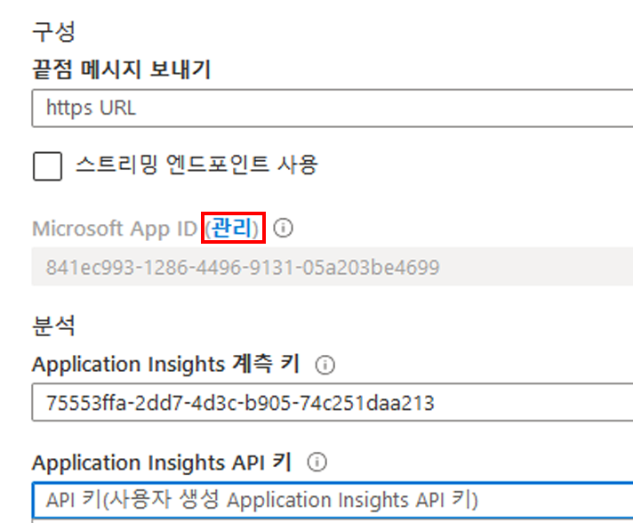
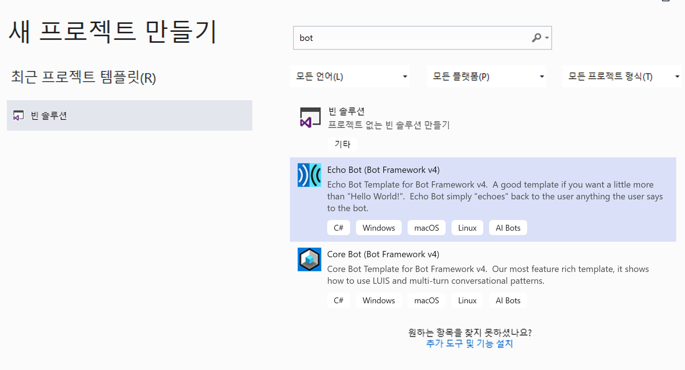
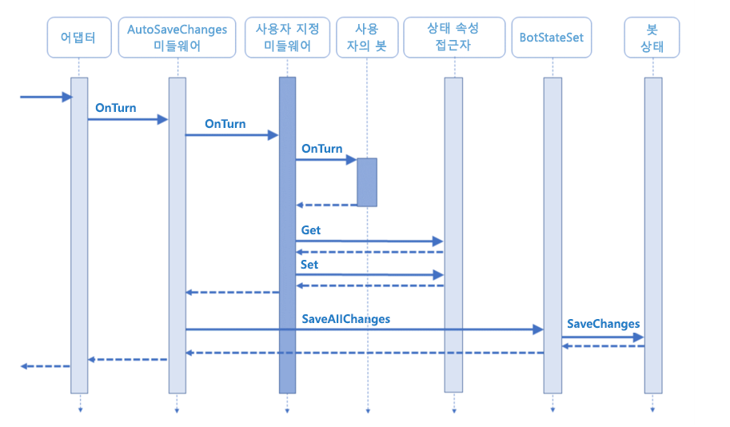

# 랩 3: 기본 필터링 봇 만들기

## 소개

모든 새로운 기술에는 많은 기회와 문제가 따르듯이, AI 기반 기술에도 고려해야 할 고유한 사항이 있습니다.
AI 도구를 설계하고 구현할 때에는 다음과 같은 AI 윤리 원칙을 염두에 두어야 합니다.

1. *공정성*: 존엄성을 파괴하지 않고 효율성 극대화
1. *책임성*: 자체 알고리즘에 책임을 지도록 AI 구현
1. *투명성*: 편견 및 인간의 존엄성 파괴 방지
1. *윤리적 적용*: 인류를 지원하고 지능적으로 개인 정보를 보호하도록 AI 설계

지능형 앱을 빌드할 때 필요한 윤리적 고려 사항을 [자세히 확인](https://ai-ethics.azurewebsites.net/)하시기 바랍니다.

## 필수 구성 요소

1. 로컬에서 봇을 테스트할 수 있도록 [Lab1-Technical_Requirements.md](../Lab1-Technical_Requirements/02-Technical_Requirements.md)에 나온 지침에 따라 v4 Bot Framework Emulator를 다운로드합니다.

## 랩 3.0 Azure 웹앱 봇 만들기

Microsoft Bot Framework를 사용하여 만든 봇은 공개적으로 액세스할 수 있는 모든 URL에서 호스트할 수 있습니다.  이 랩에서는 [Azure Bot Service](https://docs.microsoft.com/ko-kr/bot-framework/bot-service-overview-introduction)를 사용하여 봇을 등록합니다.

1. [Azure Portal](https://portal.azure.com)로 이동합니다.

1. 포털에서 리소스 그룹으로 이동한 다음 **+추가**를 클릭하고 **봇**을 검색합니다.

1. **웹앱 봇**을 선택하고 **만들기**를 클릭합니다.

1. 이름에는 고유 식별자를 만들어야 합니다. PictureBot[i][n]과 비슷한 식별자를 사용하는 것이 좋습니다. 여기서 [i]는 사용자의 이니셜이고 [n]은 번호입니다(예: 제 경우는 PictureBotamt6).

1. 지역을 선택합니다.

1. 가격 책정 계층의 경우 **F0(10K 프리미엄 메시지)**를 선택합니다. 

1. 봇 템플릿 영역을 선택합니다.

1. **C#**을 선택한 다음 **Echo Bot**을 선택합니다. 나중에 이 봇을 PictureBot으로 업데이트할 것입니다.

    

1. **확인**을 클릭하고 **Echo Bot**이 표시되는지 확인합니다.

1. 새 App Service 계획을 구성합니다(봇과 동일한 위치에 배치).

1. Application Insights를 켜거나 끌 수 있습니다.

1. **앱 ID 및 암호 자동 생성**을 클릭하지 **마십시오**. 나중에 다룰 것입니다.

1. **만들기**를 선택합니다

1. 배포되면 새 Azure 웹앱 봇 리소스로 이동합니다.

1. **봇 관리**에서 **설정**을 클릭합니다.

1. **Microsoft 앱 ID**의 **관리** 링크를 클릭합니다.



1. **새 클라이언트 암호**를 선택합니다.

1. 이름에 **PictureBot**을 입력합니다.

1. 만료의 경우 **안 함**을 선택합니다.

1. **추가**를 선택합니다.

1. 나중에 랩에서 사용할 수 있도록 메모장 등에 암호를 기록합니다.

1. **개요**를 클릭하고 나중에 랩에서 사용할 수 있도록 메모장 등에 애플리케이션 ID를 기록합니다.

1. **봇 관리**의 **웹앱 봇** 리소스로 다시 이동하고 **웹 채팅에서 테스트** 탭을 선택합니다.

1. 시작된 후에 무엇을 수행할 수 있는지 살펴봅니다.  보다시피 단지 메시지를 다시 에코할 뿐입니다.


## 랩 3.1: 단순한 봇 만들기 및 실행

1. **Visual Studio 2019** 이상을 엽니다.

1. **새 프로젝트 만들기**를 클릭하고 **봇**을 검색합니다.

1. **Echo Bot(Bot Framework v4)**이 표시될 때까지 아래로 스크롤합니다.

>[!주의]
>설치된 Visual Studio 버전에 따라 아래 스크린샷은 다르게 나타날 수 있습니다.  Echo Bot 템플릿에 대해 나열된 여러 버전이 표시되면 버전 2.1이 아닌 버전 3.1을 선택합니다.



1. **다음**을 선택합니다.

> **참고** Echo Bot 템플릿이 표시되지 않으면 필수 구성 요소 단계에서 Visual Studio 추가 기능을 설치해야 합니다.

1. 이름에 **PictureBot**을 입력하고 **만들기**를 선택합니다.

1. Echo Bot 템플릿에서 생성되는 다양한 요소를 모두 살펴보십시오. 여기서는 모든 파일을 일일이 설명하지 않지만 **이후에** 시간을 내서 이 샘플(및 다른 웹앱 봇 샘플 - Basic Bot)을 살펴보고 검토하는 것이 **좋습니다**. 이 샘플에는 봇 개발에 필요한 중요하고 유용한 셸이 포함되어 있습니다. 이 샘플과 다른 유용한 셸 및 샘플을 [여기](https://github.com/Microsoft/BotBuilder-Samples)에서 찾을 수 있습니다.

1. 먼저 솔루션을 마우스 오른쪽 단추로 클릭하고 **빌드**를 선택합니다. 이렇게 하면 nuget 패키지가 복원됩니다.

1. **appsettings.json** 파일을 열고 위에서 기록한 봇 서비스 정보를 추가하여 업데이트합니다.

```json
{
    "MicrosoftAppId": "YOURAPPID",
    "MicrosoftAppPassword": "YOURAPPSECRET"
}
```

1. 아시다시피 Visual Studio 솔루션/프로젝트의 이름을 바꾸는 것은 매우 민감한 작업입니다. 모든 이름에 EchoBot 대신 PictureBot이 반영되도록 다음 작업을 **신중하게** 완료하십시오.

1. **Bots/Echobot.cs** 파일을 마우스 오른쪽 단추로 클릭한 다음, **이름 바꾸기**를 선택하고 클래스 파일의 이름을 **PictureBot.cs**로 바꿉니다.

1. 메시지가 표시되지 않으면 클래스 이름을 수동으로 변경한 다음 클래스에 대한 모든 참조를 **PictureBot**으로 변경해야 합니다.  누락된 것이 있으면 프로젝트를 빌드하려고 할 때 이를 알게 됩니다.

1. 프로젝트를 마우스 오른쪽 단추로 클릭하고 **Nuget 패키지 관리**를 선택합니다.

1. **찾아보기** 탭을 선택하여 다음 패키지를 설치하고, 버전 **4.6.3**을 사용하고 있는지 확인합니다.

* Microsoft.Bot.Builder.Azure
* Microsoft.Bot.Builder.AI.Luis
* Microsoft.Bot.Builder.Dialogs
* Microsoft.Azure.Search(버전 10.1.0 이상)

1. 솔루션을 빌드합니다.

>**팁**:  모니터가 하나뿐이고 지침과 Visual Studio 간에 쉽게 전환하려는 경우 솔루션 탐색기에서 프로젝트를 마우스 오른쪽 단추로 클릭하고 **추가 > 기존 항목**을 선택하여 Visual Studio 솔루션에 지침 파일을 추가할 수 있습니다. "Lab2"로 이동하고 "MD 파일” 유형의 파일을 모두 추가합니다.

### Hello World 봇 만들기

이제 랩의 나머지 부분에서 사용할 명명 및 NuGet 패키지를 지원하도록 기본 셸을 업데이트했으므로 사용자 지정 코드를 추가할 수 있습니다. 먼저, V4 SDK로 봇을 빌드하기 위한 워밍업 차원에서 단순한 "Hello world" 봇을 만들겠습니다.

중요한 개념은 사용자에 대한 메시지와 봇의 응답을 나타내는 데 사용되는 `턴`입니다.
예를 들어, "Hello bot"이라고 말하고 봇이 "Hi, how are you?"라고 응답하면 이것이 **하나의** 턴입니다. **턴**이 어떻게 봇 응용 프로그램의 여러 계층을 거치는지 아래 이미지에서 살펴보십시오.



1. **PictureBot.cs** 파일을 엽니다.  

1. 아래 코드와 함께 `OnMessageActivityAsync` 메서드를 검토합니다. 대화의 모든 턴에서 이 메서드가 호출됩니다. 이것이 중요한 이유는 나중에 설명하며, 지금은 OnMessageActivityAsync가 모든 턴에서 호출된다는 점만 기억하십시오.

1. **F5** 키를 눌러 디버깅을 시작합니다.

다음과 같은 몇 가지 사항을 **알아 두어야 합니다**.

* default.htm(wwwroot 아래) 페이지가 브라우저에 표시됩니다.

* 웹 페이지의 localhost 포트 번호를 확인합니다. 이는 에뮬레이터의 엔드포인트와 일치해야 합니다.

> 문제가 발생할 경우 [{GitHubPath}/code/Finished/PictureBot-Part0](./code/Finished/PictureBot-Part0)에서 이 지점까지 발생하는 랩 문제에 대한 해결 방법을 찾을 수 있습니다. 해결 방법 내의 readme 파일에 해결 방법을 실행하기 위해 추가해야 하는 키가 나와 있습니다.

#### Bot Framework Emulator 사용

봇과 상호 작용하려면 다음과 같이 하십시오.

* Bot Framework Emulator(이 랩에서는 v4 Emulator 사용)를 시작합니다.  **시작**을 선택하고 **Bot Emulator**를 검색합니다.

* 시작 페이지에서 **새 봇 구성 만들기**를 클릭합니다.

* 이름에 **PictureBot**을 입력합니다.

* 봇 웹 페이지에 표시되는 URL을 입력합니다.

* appsettings.json에 입력한 AppId 및 앱 암호를 입력합니다.

>**참고** 봇 설정에 ID 및 암호 값을 입력하지 않은 경우 Bot Emulator에 값을 입력하지 않아도 됩니다.

* **저장 및 연결**을 클릭한 다음 .bot 파일을 로컬로 저장합니다.

* 이제 봇과 대화할 수 있습니다.

* **안녕하세요**를 입력합니다. 봇은 앞에서 만든 Azure 봇과 유사하게 메시지를 에코하면서 응답합니다.

> **참고** "대화 다시 시작"을 선택하여 대화 기록을 지울 수 있습니다.


로그에 다음과 비슷한 내용이 표시됩니다.


로컬 주소의 경우 ngrok를 바이패스한다고 나와 있습니다. 이 워크샵에서는 ngrok를 사용하지 않지만, 게시된 버전의 봇에 연결하는 경우 '프로덕션' 엔드포인트를 통해 사용합니다. '프로덕션' 엔드포인트를 열고 다양한 환경의 봇 간 차이를 살펴봅니다. 이 기능은 개발 봇을 테스트하고 프로덕션 봇과 비교할 때 유용할 수 있습니다.

에뮬레이터 사용에 대한 자세한 내용은 [여기](https://docs.microsoft.com/ko-kr/azure/bot-service/bot-service-debug-emulator?view=azure-bot-service-4.0)에서 확인할 수 있습니다.

1. 샘플 봇 코드를 찾아 살펴봅니다. 특히,

* **Startup.cs**에서는 서비스/미들웨어를 추가하고 HTTP 요청 파이프라인을 구성합니다. 이해하는 데 도움을 주는 주석이 많이 있습니다. 잠시 코드를 읽어보십시오.

* **PictureBot.cs**: `OnMessageActivityAsync` 메서드는 사용자의 메시지를 기다리는 진입점이며, 여기에서 수신된 메시지에 응답하고 추가 메시지를 기다릴 수 있습니다.  `turnContext.SendActivityAsync`를 사용하여 봇에서 사용자에게 메시지를 다시 보낼 수 있습니다.

## 랩 3.2:  상태 및 서비스 관리

1. **Startup.cs** 파일로 다시 이동합니다.

1. 다음을 **추가하여** `using` 문 목록을 업데이트합니다.

```csharp
using System;
using System.Linq;
using System.Text.RegularExpressions;
using Microsoft.Bot.Builder.Integration;
using Microsoft.Bot.Configuration;
using Microsoft.Bot.Connector.Authentication;
using Microsoft.Extensions.Options;
using Microsoft.Extensions.Logging;
using Microsoft.PictureBot;

using Microsoft.Bot.Builder.AI.Luis;
using Microsoft.Bot.Builder.Dialogs;
```

아직은 위의 네임스페이스를 모두 사용하지 않습니다. 그렇다면 언제 사용할까요?

1. **Startup.cs** 클래스에서는 봇에 서비스를 추가하는 데 사용되는 `ConfigureServices` 메서드에 중점을 두고, 내용을 주의 깊게 검토하면서 기본으로 포함된 항목을 확인하십시오.

> 더 깊은 이해를 위해 다음 사항을 참고하십시오.
>
> * 종속성 주입에 익숙하지 않은 경우 [여기에서 자세한 내용을 확인](https://docs.microsoft.com/ko-kr/aspnet/web-api/overview/advanced/dependency-injection)할 수 있습니다.
> * 이 랩 및 테스트를 위해 로컬 메모리를 사용할 수 있습니다. 프로덕션의 경우 [상태 데이터를 관리](https://docs.microsoft.com/ko-kr/azure/bot-service/bot-builder-storage-concept?view=azure-bot-service-4.0)하는 방법을 구현해야 합니다. `ConfigureServices` 내의 많은 주석에 몇 가지 관련 팁이 나와 있습니다.
> * 메서드의 맨 아래에서는 상태 접근자를 만들고 등록합니다. 상태 관리는 지능형 봇을 만드는 데 핵심적입니다. [여기에서 자세한 내용을 확인](https://docs.microsoft.com/ko-kr/azure/bot-service/bot-builder-dialog-state?view=azure-bot-service-4.0)할 수 있습니다.

다행히 이 셸은 매우 포괄적이므로 다음 두 가지 항목만 추가하면 됩니다.

* 미들웨어
* 사용자 지정 상태 접근자

### 미들웨어

미들웨어는 단순히 어댑터와 봇 논리 사이에 있는 클래스 또는 클래스 집합으로, 초기화하는 동안 어댑터의 미들웨어 컬렉션에 추가됩니다.

SDK를 사용하면 고유한 미들웨어를 작성하거나 다른 사용자가 만든 미들웨어의 재사용 가능한 구성 요소를 추가할 수 있습니다. 봇에서 입력 및 출력되는 모든 활동은 미들웨어를 통과합니다. 랩의 뒷부분에서 자세히 살펴보겠지만, 지금은 모든 활동이 미들웨어를 통과한다는 점을 이해하는 것이 중요합니다. 미들웨어는 런타임에 호출되는 `ConfigureServices` 메서드(사용자가 보내는 모든 메시지와 `OnMessageActivityAsync` 사이에 실행)에 위치하기 때문입니다.

1. **Middleware**라는 새 폴더를 추가합니다.

1. **Middleware** 폴더를 마우스 오른쪽 단추로 클릭하고 **추가 > 기존 항목**을 선택합니다.

1. **{GitHubDir}\Lab3-Basic_Filter_Bot\code\Middleware**로 이동하여 세 파일을 모두 선택하고 **추가**를 선택합니다.

1. **시작** 클래스에 다음 변수를 추가합니다.

```csharp
private ILoggerFactory _loggerFactory;
private bool _isProduction = false;
```

1. **ConfigureServices** 메서드에서 다음 코드를 교체합니다.

```csharp
services.AddTransient<IBot, PictureBot.Bots.PictureBot>();
```

다음 코드로 바꿉니다.

```csharp
services.AddBot<PictureBot.Bots.PictureBot>(options =>
{
    var appId = Configuration.GetSection("MicrosoftAppId")?.Value;
                var appSecret = Configuration.GetSection("MicrosoftAppPassword")?.Value;

                options.CredentialProvider = new SimpleCredentialProvider(appId, appSecret);

    // 애플리케이션에서 사용할 로거를 만듭니다.
    ILogger logger = _loggerFactory.CreateLogger<PictureBot.Bots.PictureBot>();

    // 대화 턴 중에 발생하는 오류를 catch하고 기록합니다.
    options.OnTurnError = async (context, exception) =>
    {
        logger.LogError($"Exception caught : {exception}");
        await context.SendActivityAsync("Sorry, it looks like something went wrong.");
    };

    // 여기서 사용되는 메모리 스토리지는 로컬 봇 디버깅 전용입니다. 봇이
    // 다시 시작되면 메모리에 저장된 모든 것이 사라집니다.
    IStorage dataStore = new MemoryStorage();

    // 프로덕션 봇의 경우 Azure Blob 또는
    // Azure CosmosDB Storage 공급자를 사용합니다. Azure
    // 기반 스토리지 공급자의 경우, Microsoft.Bot.Builder.Azure
    // Nuget 패키지를 솔루션에 추가합니다. 해당 패키지는 다음에서 찾을 수 있습니다.
    // https://www.nuget.org/packages/Microsoft.Bot.Builder.Azure/
    // Azure Blob Storage
    // //스토리지 구성 이름 또는 봇 파일의 ID 이름을 사용하려면 다음 줄의 주석을 해제합니다.
    // const string StorageConfigurationId = "<STORAGE-NAME-OR-ID-FROM-BOT-FILE>";
    // var blobConfig = botConfig.FindServiceByNameOrId(StorageConfigurationId);
    // if (!(blobConfig is BlobStorageService blobStorageConfig))
    // {
    //    throw new InvalidOperationException($"The .bot file does not contain an blob storage with name '{StorageConfigurationId}'.");
    // }
    // // 기본 컨테이너 이름입니다.
    // const string DefaultBotContainer = "botstate";
    // var storageContainer = string.IsNullOrWhiteSpace(blobStorageConfig.Container) ? DefaultBotContainer : blobStorageConfig.Container;
    // IStorage dataStore = new Microsoft.Bot.Builder.Azure.AzureBlobStorage(blobStorageConfig.ConnectionString, storageContainer);

    // 대화 상태 개체를 만듭니다.
    // 대화 상태 개체는 대화 범위에서 모든 것을 유지하는 위치입니다.
    var conversationState = new ConversationState(dataStore);

    options.State.Add(conversationState);

    var middleware = options.Middleware;
    // "middleware.Add(...."를 사용하여 아래에 미들웨어를 추가합니다.
    // 아래에 Regex를 추가합니다.
});
```

1. **Configure** 메서드를 다음 코드로 바꿉니다.

```csharp
public void Configure(IApplicationBuilder app, IHostingEnvironment env, ILoggerFactory loggerFactory)
{
    _loggerFactory = loggerFactory;

    app.UseDefaultFiles()
        .UseStaticFiles()
        .UseBotFramework();

    app.UseMvc();
}
```

#### 사용자 지정 상태 접근자

필요한 사용자 지정 상태 접근자에 대해 이야기하기 전에 보충 설명을 드리겠습니다. 대화 상자는 다음 섹션에서 자세히 살펴보겠지만 여러 턴의 대화 논리를 구현하는 방식으로, 지속 상태를 통해 대화 내에서 사용자가 진행 중인 단계를 파악해야 합니다. 대화 상자 기반 봇에서는 DialogSet을 사용하여 다양한 대화 상자를 담습니다. DialogSet는 "접근자"라는 개체에 대한 핸들로 만들어집니다.

SDK에서 접근자는 기본적으로 상태에 대한 정보를 얻고 설정하고 삭제할 수 있는 기능을 제공하는 `IStatePropertyAccessor` 인터페이스를 구현하므로 대화 내에서 사용자가 진행 중인 단계를 추적할 수 있습니다.

만드는 각 접근자에 대해 먼저 속성 이름을 지정해야 합니다. 이 랩에서는 다음과 같은 몇 가지 사항을 추적하려고 합니다.

1. `PictureState`
    * 사용자에게 인사했습니까?
        * 두 번 이상 인사하는 것은 원하지 않으며, 대화를 시작할 때 인사하고자 합니다.
    * 사용자가 현재 특정 용어를 검색하고 있습니까? 그렇다면 그것은 무엇입니까?
        * 사용자가 검색할 내용을 알려주었는지 그리고 알려주었다면 그것이 무엇인지를 추적해야 합니다.
2. `DialogState`
    * 사용자가 현재 대화 중입니까?
        * 이를 통해 사용자가 해당 대화 상자 또는 대화 흐름 중에 어느 단계에 있는지를 파악합니다. 대화 상자에 대해 잘 모르더라도 걱정할 필요 없습니다. 곧 관련 내용을 다룰 것입니다.

이러한 구문을 사용하여 `PictureState`를 추적할 수 있습니다.

1. **Startup.cs** 파일의 **ConfigureServices** 메서드에서 사용자 지정 상태 접근자 목록 내에 `PictureState`를 추가하고, 대화를 추적하기 위해 기본 제공 `DialogState`를 사용합니다.

```csharp
// 상태 접근자를 만들고 등록합니다.
// 여기에서 생성된 접근자는 턴마다 IBot에서 파생된 클래스로 전달됩니다.
services.AddSingleton<PictureBotAccessors>(sp =>
{
    var options = sp.GetRequiredService<IOptions<BotFrameworkOptions>>().Value;
    if (options == null)
    {
        throw new InvalidOperationException("BotFrameworkOptions must be configured prior to setting up the state accessors");
    }

    var conversationState = options.State.OfType<ConversationState>().FirstOrDefault();
    if (conversationState == null)
    {
        throw new InvalidOperationException("ConversationState must be defined and added before adding conversation-scoped state accessors.");
    }

    // 사용자 지정 상태 접근자를 만듭니다.
    // 상태 접근자는 다른 구성 요소가 상태의 개별 속성을 읽고 쓸 수 있도록 합니다.
    var accessors = new PictureBotAccessors(conversationState)
    {
        PictureState = conversationState.CreateProperty<PictureState>(PictureBotAccessors.PictureStateName),
        DialogStateAccessor = conversationState.CreateProperty<DialogState>("DialogState"),
    };

    return accessors;
});
```

일부 용어 아래에 오류(빨간색 물결)가 표시됩니다. 그런데 오류를 해결하기에 앞서, 왜 한 개로 부족하여 두 개의 접근자를 만들어야 했는지 설명하겠습니다.

* `DialogState`는 `Microsoft.Bot.Builder.Dialogs` 라이브러리에서 제공하는 특정 접근자입니다. 메시지가 전송되면 Dialog 하위 시스템이 `DialogSet`에서 `CreateContext`를 호출합니다. 이 컨텍스트를 추적하려면 특히 해당 대화 상자 상태 JSON을 얻기 위한 `DialogState` 접근자가 필요합니다.
* 반면에 `PictureState`는 대화 전반에 걸쳐 지정하는 특정 대화 속성(예: 사용자에게 인사했는지 여부)을 추적하는 데 사용됩니다.

> 대화 상자 전문 용어는 아직 몰라도 프로세스를 이해하는 데 문제 없을 것입니다. 혼동되는 경우 [상태 작동 방식에 대한 자세한 내용을 확인](https://docs.microsoft.com/ko-kr/azure/bot-service/bot-builder-dialog-state?view=azure-bot-service-4.0)해 볼 수 있습니다.

이제 표시되는 오류에 대해 다시 살펴보겠습니다. 이 정보를 저장한다고 했지만 아직 위치나 방법을 지정하지 않았습니다. 저장하려는 정보를 얻고 액세스하려면 "PictureState.cs"와 "PictureBotAccessor.cs"를 업데이트해야 합니다.

1. 프로젝트를 마우스 오른쪽 단추로 클릭하고 **추가->클래스**를 선택한 후, 클래스 파일을 선택하고 **PictureState**라는 이름을 지정합니다.

1. 다음 코드를 **PictureState.cs**에 복사합니다.

```csharp
using System.Collections.Generic;

namespace Microsoft.PictureBot
{
    /// <summary>
    /// 대화에 대한 카운터 상태를 저장합니다.
    /// <see cref="Microsoft.Bot.Builder.ConversationState"/>에 저장되고
    /// <see cref="Microsoft.Bot.Builder.MemoryStorage"/>에 의해 백업됩니다.
    /// </summary>
    public class PictureState
    {
        /// <summary>
        /// 대화의 턴 수를 가져오거나 설정합니다.
        /// </summary>
        /// <value>대화의 턴 수입니다.</value>
        public string Greeted { get; set; } = "not greeted";
        public string Search { get; set; } = "";
        public string Searching { get; set; } = "no";
    }
}
```

1. 코드를 검토합니다.  여기에 활성 대화에 대한 정보를 저장합니다.  문자열의 목적을 설명하는 몇 가지 주석을 추가할 수 있습니다. 이제 PictureState가 적절히 초기화되었으므로 PictureBotAccessor를 만들어 **Startup.cs**에서 발생한 오류를 제거할 수 있습니다.

1. 프로젝트를 마우스 오른쪽 단추로 클릭하고 **추가->클래스**를 선택한 후, 클래스 파일을 선택하고 **PictureBotAccessors**라는 이름을 지정합니다.

1. 다음을 복사합니다.

```csharp
using System;
using Microsoft.Bot.Builder;
using Microsoft.Bot.Builder.Dialogs;

namespace Microsoft.PictureBot
{
    /// <summary>
    /// 이 클래스는 싱글톤으로 만들어지고 IBot 파생 생성자로 전달됩니다.
    ///  - 주입 방법은 <see cref="PictureBot"/> 생성자를 참조하십시오.
    ///  - 생성자에 주입될 싱글톤을 만드는 방법에 대한 자세한 내용은 Startup.cs 파일을
    ///    참조하십시오.
    /// </summary>
    public class PictureBotAccessors
    {
        /// <summary>
        /// <see cref="PictureBotAccessors"/> 클래스의 새 인스턴스를 초기화합니다.
        /// <see cref="ConversationState"/> 및 연관된 <see cref="IStatePropertyAccessor{T}"/>를 포함합니다.
        /// </summary>
        /// <param name="conversationState">카운터를 저장하는 상태 개체입니다.</param>
        public PictureBotAccessors(ConversationState conversationState)
        {
            ConversationState = conversationState ?? throw new ArgumentNullException(nameof(conversationState));
        }

        /// <summary>
        /// <see cref="CounterState"/> 접근자에 사용되는 <see cref="IStatePropertyAccessor{T}"/> 이름을 가져옵니다.
        /// </summary>
        /// <remarks>접근자는 고유한 이름이 필요합니다.</remarks>
        /// <value>카운터 접근자의 접근자 이름입니다.</value>
        public static string PictureStateName { get; } = $"{nameof(PictureBotAccessors)}.PictureState";

        /// <summary>
        /// CounterState의 <see cref="IStatePropertyAccessor{T}"/>를 가져오거나 설정합니다.
        /// </summary>
        /// <value>
        /// 접근자는 대화의 턴 수를 저장합니다.
        /// </value>
        public IStatePropertyAccessor<PictureState> PictureState { get; set; }

        /// <summary>
        /// 대화의 <see cref="ConversationState"/> 개체를 가져옵니다.
        /// </summary>
        /// <value><see cref="ConversationState"/> 개체입니다.</value>
        public ConversationState ConversationState { get; }

        /// <summary> DialogState 접근자에 사용되는 IStatePropertyAccessor{T} 이름을 가져옵니다. </summary>
        public static string DialogStateName { get; } = $"{nameof(PictureBotAccessors)}.DialogState";

        /// <summary> DialogState에 대한 IStatePropertyAccessor{T}를 가져오거나 설정합니다. </summary>
        public IStatePropertyAccessor<DialogState> DialogStateAccessor { get; set; }
    }
}
```

1. 코드를 검토하고 `PictureStateName` 및 `PictureState`의 구현을 확인합니다.

1. 올바르게 구성했는지 알아보려면 **Startup.cs**로 돌아가 사용자 지정 상태 접근자를 만드는 과정에서 발생한 오류가 해결되었는지 확인합니다.

## 랩 3.3: 봇 코드 구성

봇을 개발하는 데는 다양한 방법과 선호하는 방식이 있습니다. SDK를 사용하면 원하는 모든 방식으로 코드를 구성할 수 있습니다. 이 랩에서는 대화를 다양한 대화 상자로 구성하고 대화를 중심으로 코드를 구성하는 [MVVM 스타일](https://msdn.microsoft.com/ko-kr/library/hh848246.aspx)을 살펴보겠습니다.

이 PictureBot은 다음과 같은 방식으로 구성됩니다.

* **대화 상자** - 모델을 편집하기 위한 비즈니스 논리
* **응답** - 사용자에 대한 출력을 정의하는 클래스
* **모델** - 수정할 개체

1. 프로젝트를 마우스 오른쪽 단추로 클릭하고 **추가->새 폴더**를 선택하여 프로젝트 내에서 두 개의 새 폴더("**Responses**" 및 "**Models**")를 만듭니다.

### 대화 상자

대화 상자와 대화 상자의 작동 방식에 대해서는 익히 알고 있을 것입니다. 그렇지 않은 경우 [대화 상자에 대한 이 페이지](https://docs.microsoft.com/ko-kr/azure/bot-service/bot-builder-dialog-manage-conversation-flow?view=azure-bot-service-4.0&tabs=csharp)를 읽으십시오.

봇이 여러 작업을 수행할 수 있는 경우, 사용자가 다양한 대화 흐름을 탐색할 수 있도록 여러 대화 상자 또는 대화 상자 집합을 사용하는 것이 좋습니다. PictureBot의 경우 사용자가 초기 메뉴 흐름(주 대화 상자라고도 함)을 거친 다음 사진 검색/공유/주문 또는 도움 받기 등 사용자가 원하는 내용에 따라 다른 대화 상자로 분기할 수 있도록 하려고 합니다. 대화 상자 컨테이너 또는 `DialogSet`를 사용하여 쉽게 이 작업을 수행할 수 있습니다. 계속하기 전에 [모듈식 봇 논리 및 복잡한 대화 상자 만들기](https://docs.microsoft.com/ko-kr/azure/bot-service/bot-builder-compositcontrol?view=azure-bot-service-4.0&tabs=csharp)에 대해 읽어보십시오.

이 랩에서는 작업을 매우 단순하게 유지하려고 하지만, 이후에는 많은 대화 상자로 구성된 대화 상자 집합을 만들 수 있어야 합니다. PictureBot의 경우 두 개의 주요 대화 상자가 있습니다.

* **MainDialog** - 봇이 시작하는 기본 대화입니다. 이 대화 상자는 사용자가 요청할 때 다른 대화 상자를 시작합니다. 이 대화 상자는 대화 상자 집합의 주 대화 상자이기 때문에 대화 상자 컨테이너를 만들고 필요에 따라 사용자를 다른 대화 상자로 리디렉션합니다.

* **SearchDialog** - 검색 요청을 처리하고 해당 결과를 사용자에게 반환하는 작업을 관리하는 대화 상자입니다.  ***참고** 이 기능을 호출하지만 이 워크샵에서는 검색을 구현하지 않습니다.*

대화 상자가 두 개 뿐이므로 간단하게 유지하고 PictureBot 클래스에 넣을 수 있습니다. 그러나 복잡한 시나리오에서는 응답과 모델을 분리하는 방법과 유사하게 한 폴더 내의 다른 대화 상자로 분할해야 할 수 있습니다.

1. **PictureBot.cs**로 다시 이동하여 `using` 문을 다음으로 바꿉니다.

```csharp
using System.Threading;
using System.Threading.Tasks;
using Microsoft.Bot.Builder;
using Microsoft.Bot.Schema;
using Microsoft.Bot.Builder.Dialogs;
using Microsoft.Extensions.Logging;
using System.Linq;
using PictureBot.Models;
using PictureBot.Responses;
using Microsoft.Bot.Builder.AI.Luis;
using Microsoft.Azure.Search;
using Microsoft.Azure.Search.Models;
using System;
using Newtonsoft.Json;
using Newtonsoft.Json.Linq;
using Microsoft.PictureBot;
```

Models/Responses와 LUIS 및 Azure Cognitive Search 서비스에 대한 액세스를 추가했습니다. 마지막으로, 이후 랩에서 살펴볼 LUIS의 응답을 구문 분석하는 데 Newtonsoft 참조가 도움이 됩니다.

다음으로 `OnTurnAsync` 메서드를, 들어오는 메시지를 처리한 후 다양한 대화 상자를 통해 라우팅하는 메서드로 재정의합니다.

1. **PictureBot** 클래스의 코드를 다음으로 바꿉니다.

```csharp
/// <summary>
/// 들어오는 활동을 처리하는 봇을 나타냅니다.
/// 각 사용자 상호 작용에 대해 이 클래스의 인스턴스가 만들어지고 OnTurnAsync 메서드가 호출됩니다.
/// 이것은 Transient lifetime 서비스입니다.  Transient lifetime 서비스는
/// 요청될 때마다 만들어집니다. 수신되는 각 활동에 대해 이 클래스의
/// 새 인스턴스가 만들어집니다. 생성하는 데 비용이 많이 들거나 수명이
/// 단일 턴을 초과하는 개체는 신중하게 관리해야 합니다.
/// 예를 들어, <see cref="MemoryStorage"/> 개체와 연결된
/// <see cref="IStatePropertyAccessor{T}"/> 개체는 싱글톤 수명으로 만들어집니다.
/// </summary>
/// <seealso cref="https://docs.microsoft.com/ko-kr/aspnet/core/fundamentals/dependency-injection?view=aspnetcore-2.1"/>
/// <summary>PictureBot에 대한 대화 상자 및 프롬프트 집합이 포함되어 있습니다.</summary>
public class PictureBot : ActivityHandler
{
    private readonly PictureBotAccessors _accessors;
    // LUIS Recognizer를 초기화합니다.

    private readonly ILogger _logger;
    private DialogSet _dialogs;

    /// <summary>
    /// PictureBot의 모든 대화 턴에서 이 메서드가 호출됩니다.
    /// 대화 상자는 사용되지 않습니다. "단일 턴" 처리, 즉 단일
    /// 요청 및 응답이기 때문입니다. 나중에 대화 상자를 추가할 때 이 메서드를 탐색해야 합니다.
    /// </summary>
    /// <param name="turnContext">이 대화 턴을 처리하는 데 필요한 모든 데이터를 포함한
    /// <see cref="ITurnContext"/>입니다. </param>
    /// <param name="cancellationToken">(선택 사항) 다른 개체 또는 스레드가 취소 알림을 받는 데
    /// 사용될 수 있는 <see cref="CancellationToken"/>입니다.</param>
    /// <returns>실행을 위해 큐에 대기되는 작업을 나타내는 <see cref="Task"/>입니다.</returns>
    /// <seealso cref="BotStateSet"/>
    /// <seealso cref="ConversationState"/>
    /// <seealso cref="IMiddleware"/>
    public override async Task OnTurnAsync(ITurnContext turnContext, CancellationToken cancellationToken = default(CancellationToken))
    {
        if (turnContext.Activity.Type is "message")
        {
            // 대화 상태에서 대화 상자 컨텍스트를 설정합니다.
            var dc = await _dialogs.CreateContextAsync(turnContext);
            // 현재 대화 상자를 계속합니다.
            var results = await dc.ContinueDialogAsync(cancellationToken);

            // 모든 턴에서 응답이 전송되므로, 응답이 전송되지 않은 경우
            // 현재 활성 상태인 대화 상자가 없는 것입니다.
            if (!turnContext.Responded)
            {
                // 주 대화 상자를 시작합니다.
                await dc.BeginDialogAsync("mainDialog", null, cancellationToken);
            }
        }
    }
    /// <summary>
    /// <see cref="PictureBot"/> 클래스의 새 인스턴스를 초기화합니다.
    /// </summary>
    /// <param name="accessors">상태를 관리하는 데 사용되는 <see cref="IStatePropertyAccessor{T}"/>가 포함된 클래스입니다.</param>
    /// <param name="loggerFactory">Azure App Service 공급자에 연결되는 <see cref="ILoggerFactory"/>입니다.</param>
    ///<seealso cref="https://docs.microsoft.com/ko-kr/aspnet/core/fundamentals/logging/?view=aspnetcore-2.1#windows-eventlog-provider"></seealso>
    public PictureBot(PictureBotAccessors accessors, ILoggerFactory loggerFactory /*, LuisRecognizer recognizer*/)
    {
        if (loggerFactory == null)
        {
            throw new System.ArgumentNullException(nameof(loggerFactory));
        }

        // LUIS Recognizer의 인스턴스를 추가합니다.

        _logger = loggerFactory.CreateLogger<PictureBot>();
        _logger.LogTrace("PictureBot turn start.");
        _accessors = accessors ?? throw new System.ArgumentNullException(nameof(accessors));

        // DialogSet는 DialogState 접근자를 필요로 하며 턴 컨텍스트가 있을 때 이를 호출합니다.
        _dialogs = new DialogSet(_accessors.DialogStateAccessor);

        // 이 배열은 폭포가 실행되는 방법을 정의합니다.
        // 여기에서 다양한 대화 상자와 단계를 정의하며,
        // 필요에 따라 겹치도록 허용할 수 있습니다. 이 경우에는 매우 단순하지만
        // 더 복잡한 시나리오에서는 서로 다른 대화 상자를
        // 서로 다른 파일로 분리하는 것이 좋습니다.
        var main_waterfallsteps = new WaterfallStep[]
        {
            GreetingAsync,
            MainMenuAsync,
        };
        var search_waterfallsteps = new WaterfallStep[]
        {
            // SearchDialog 폭포 단계를 추가합니다.

        };

        // 명명된 대화 상자를 DialogSet에 추가합니다. 이러한 이름은 대화 상자 상태에 저장됩니다.
        _dialogs.Add(new WaterfallDialog("mainDialog", main_waterfallsteps));
        _dialogs.Add(new WaterfallDialog("searchDialog", search_waterfallsteps));
        // 다음 줄을 통해 대화 상자 내에서 프롬프트를 사용할 수 있습니다.
        _dialogs.Add(new TextPrompt("searchPrompt"));
    }
    // MainDialog 관련 작업을 추가합니다.

    // SearchDialog 관련 작업을 추가합니다.

    // 검색 관련 작업을 추가합니다.

}
```

잠시 이 셸을 검토하고 동료 워크샵 참가자와 논의하십시오. 계속하기 전에 각 줄의 목적을 파악해야 합니다.

조금 후에 여기에 약간의 내용을 추가하겠습니다. 지금은 오류를 무시해도 됩니다.

#### 응답

대화 상자를 작성하기 전에 몇 가지 응답을 준비해야 합니다. 대화 상자와 응답을 구분하면 코드가 더 깔끔해지고 대화 상자의 논리를 따르기가 더 쉽습니다. 지금은 아니더라도 곧 동의하거나 이해하게 될 것입니다.

1. **Responses** 폴더에서 **MainResponses.cs** 및 **SearchResponses.cs**라는 두 개의 클래스를 만듭니다. 예상할 수 있듯이, 응답 파일에는 사용자에게 보낼 수 있는 여러 가지 출력만 포함되며 논리는 없습니다.

1. **MainResponses.cs**에서 코드를 다음으로 교체합니다.

```csharp
using System.Threading.Tasks;
using Microsoft.Bot.Builder;

namespace PictureBot.Responses
{
    public class MainResponses
    {
        public static async Task ReplyWithGreeting(ITurnContext context)
        {
            // 인사말을 추가합니다.
        }
        public static async Task ReplyWithHelp(ITurnContext context)
        {
            await context.SendActivityAsync($"I can search for pictures, share pictures and order prints of pictures.");
        }
        public static async Task ReplyWithResumeTopic(ITurnContext context)
        {
            await context.SendActivityAsync($"What can I do for you?");
        }
        public static async Task ReplyWithConfused(ITurnContext context)
        {
            // 사용자가 전달하려는 내용을 Regex 또는 LUIS로 파악하지 못할 경우
            // 사용자에게 표시할 응답을 추가합니다.
        }
        public static async Task ReplyWithLuisScore(ITurnContext context, string key, double score)
        {
            await context.SendActivityAsync($"Intent: {key} ({score}).");
        }
        public static async Task ReplyWithShareConfirmation(ITurnContext context)
        {
            await context.SendActivityAsync($"Posting your picture(s) on twitter...");
        }
        public static async Task ReplyWithOrderConfirmation(ITurnContext context)
        {
            await context.SendActivityAsync($"Ordering standard prints of your picture(s)...");
        }
    }
}
```

값이 없는 응답이 두 개 있습니다(ReplyWithGreeting 및 ReplyWithConfused). 필요한 경우 값을 기입하십시오.

1. "SearchResponses.cs"에서 코드를 다음으로 교체합니다.

```csharp
using Microsoft.Bot.Builder;
using System;
using System.Collections.Generic;
using System.Linq;
using System.Threading.Tasks;
using Microsoft.Bot.Schema;

namespace PictureBot.Responses
{
    public class SearchResponses
    {
        // 상황에 맞춰 수행해야 할 "ReplyWithSearchRequest"라는
        // 작업을 추가하고 사용자에게
        // 검색하려는 내용을 묻습니다.
        public static async Task ReplyWithSearchConfirmation(ITurnContext context, string utterance)
        {
            await context.SendActivityAsync($"Ok, searching for pictures of {utterance}");
        }
        public static async Task ReplyWithNoResults(ITurnContext context, string utterance)
        {
            await context.SendActivityAsync("There were no results found for \"" + utterance + "\".");
        }
    }
}
```

1. 전체 작업이 누락되었습니다. 필요한 경우 작업을 기입하되 새 작업의 이름을 "ReplyWithSearchRequest"로 지정합니다. 그러지 않으면 나중에 문제가 발생할 수 있습니다.

#### 모델

시간 제한으로 인해 모든 모델을 만들어보지는 않을 것입니다. 간단하지만 모델을 추가한 후 코드를 잠시 검토하는 것이 좋습니다. 

1. **Models** 폴더를 마우스 오른쪽 단추로 클릭하고 **추가 > 기존 항목**을 선택합니다.

1. **{GitHubDir}\Lab3-Basic_Filter_Bot\code\Models**로 이동하여 세 파일을 모두 선택하고 **추가**를 선택합니다.

## 랩 3.4: Regex 및 미들웨어

봇을 개선하기 위해 할 수 있는 일이 여러 가지 있습니다. 우선, 봇이 사용자로부터 상당히 자주 수신하는 간단한 "사진 검색" 메시지를 위해 LUIS를 호출하는 것은 좋지 않습니다.  단순한 정규식이 이와 일치할 수 있으며 네트워크 대기 시간으로 인한 시간과 LUIS 서비스를 호출하는 데 드는 비용을 줄여 줍니다.

또한 봇의 복잡성이 증가하는 동시에, 사용자의 입력을 받고 다양한 서비스를 사용하여 해석하기 때문에 이 흐름을 관리하는 프로세스가 필요합니다.  예를 들어 정규식을 먼저 시도하고 일치하지 않을 경우 LUIS를 호출합니다. 그리고 이후에는 드롭다운하여 [QnA Maker](http://qnamaker.ai) 또는 Azure Cognitive Search와 같은 다른 서비스를 사용해 볼 수 있습니다. 이를 관리하는 좋은 방법은 [미들웨어](https://docs.microsoft.com/ko-kr/azure/bot-service/bot-builder-concept-middleware?view=azure-bot-service-4.0)를 사용하는 것이며, SDK가 미들웨어를 효과적으로 지원합니다.

랩을 계속하기 전에 미들웨어와 Bot Framework SDK에 대해 자세히 알아보십시오.

1. [개요 및 아키텍처](https://docs.microsoft.com/ko-kr/azure/bot-service/bot-builder-basics?view=azure-bot-service-4.0)

1. [미들웨어](https://docs.microsoft.com/ko-kr/azure/bot-service/bot-builder-concept-middleware?view=azure-bot-service-4.0)

1. [미들웨어 만들기](https://docs.microsoft.com/ko-kr/azure/bot-service/bot-builder-create-middleware?view=azure-bot-service-4.0&tabs=csaddmiddleware%2Ccsetagoverwrite%2Ccsmiddlewareshortcircuit%2Ccsfallback%2Ccsactivityhandler)

몇 가지 미들웨어를 사용하여 먼저 정규식(Regex)으로 사용자가 말하는 내용을 이해하려고 노력하며 이해할 수 없는 경우 LUIS를 호출하겠습니다. 그래도 이해할 수 없다면 일반적인 "무슨 말씀이신지 잘 모르겠습니다." 같은 응답이나 "ReplyWithConfused"에 할당할 내용을 사용하겠습니다.

1. **Startup.cs**에서 `ConfigureServices` 내에 있는 "아래에 Regex를 추가합니다." 주석 아래에 다음을 추가합니다.

```csharp
middleware.Add(new RegExpRecognizerMiddleware()
.AddIntent("search", new Regex("search picture(?:s)*(.*)|search pic(?:s)*(.*)", RegexOptions.IgnoreCase))
.AddIntent("share", new Regex("share picture(?:s)*(.*)|share pic(?:s)*(.*)", RegexOptions.IgnoreCase))
.AddIntent("order", new Regex("order picture(?:s)*(.*)|order print(?:s)*(.*)|order pic(?:s)*(.*)", RegexOptions.IgnoreCase))
.AddIntent("help", new Regex("help(.*)", RegexOptions.IgnoreCase)));

```

> 여기서는 맛보기 수준으로 정규식 사용에 대해 살펴보았으며, 관심이 있으면 [여기에서 자세한 내용을 알아볼](https://docs.microsoft.com/ko-kr/dotnet/standard/base-types/regular-expression-language-quick-reference) 수 있습니다.

1. `options.State`를 더 이상 사용하지 않는다는 것을 알 수 있을 것입니다.  최신 메서드로 마이그레이션해 보겠습니다.

1. 다음 코드를 제거합니다.

```csharp
var conversationState = new ConversationState(dataStore);

options.State.Add(conversationState);
```

1. 다음으로 바꿉니다.

```csharp
var userState = new UserState(dataStore);
var conversationState = new ConversationState(dataStore);

// 사용자 상태를 만듭니다.
services.AddSingleton<UserState>(userState);

// 대화 상태를 만듭니다.
services.AddSingleton<ConversationState>(conversationState);
```

1. 또한 이제 종속성 주입 버전에서 끌어오도록 `ConfigureServices` 코드를 바꿉니다.

```csharp
var conversationState = options.State.OfType<ConversationState>().FirstOrDefault();
if (conversationState == null)
{
    throw new InvalidOperationException("ConversationState must be defined and added before adding conversation-scoped state accessors.");
}
```

1. 다음으로 바꿉니다.

```csharp
var conversationState = services.BuildServiceProvider().GetService<ConversationState>();

if (conversationState == null)
{
    throw new InvalidOperationException("ConversationState must be defined and added before adding conversation-scoped state accessors.");
}
```

LUIS를 추가하지 않으면 봇이 몇 가지 변형만 선택하지만, 사용자가 사진을 검색, 공유 및 주문하는 정도로 봇을 사용하는 경우 메시지를 이해하는 데 큰 문제 없습니다.

> 참고: 봇이 할 수 있는 일에 대한 명확한 옵션의 메뉴를 얻기 위해 사용자가 "도움말"을 입력할 필요가 없이, 봇과 처음 접촉할 때 기본 환경에 이것이 포함되어야 한다고 생각할 수 있습니다. **검색 기능**, 즉 봇이 할 수 있는 일을 사용자가 알도록 하는 것은 봇의 최대 과제 중 하나입니다.  적절한 [봇 디자인 원칙](https://docs.microsoft.com/ko-kr/bot-framework/bot-design-principles)이 도움이 될 수 있습니다.

## 랩 3.5: 봇 실행

### MainDialog(위에서 계속)

이제 본격적인 작업에 들어가보겠습니다. 사용자가 원하다고 말하는 내용에 봇이 반응할 수 있도록 PictureBot.cs 내에 MainDialog를 작성해야 합니다. Regex의 결과에 따라 올바른 방향으로 대화를 유도해야 합니다. 코드를 주의 깊게 읽고 코드의 역할을 파악합니다.

1. **PictureBot.cs**에서 다음 메서드 코드를 붙여넣어 추가합니다.

```csharp
// 아직 사용자에게 인사하지 않은 경우 먼저 인사하지만 나머지
// 대화에서 이미 인사했다는 사실을 기억하려고 합니다.
private async Task<DialogTurnResult> GreetingAsync(WaterfallStepContext stepContext, CancellationToken cancellationToken)
{
    // 대화의 현재 단계에 대한 상태를 가져옵니다.
    var state = await _accessors.PictureState.GetAsync(stepContext.Context, () => new PictureState());

    // 사용자에게 인사하지 않은 경우
    if (state.Greeted == "not greeted")
    {
        // 사용자에게 인사합니다.
        await MainResponses.ReplyWithGreeting(stepContext.Context);
        // GreetedState를 greeted로 업데이트합니다.
        state.Greeted = "greeted";
        // 새 greeted 상태를 대화 상태로 저장합니다.
        // 이는 향후 턴에서 사용자에게 다시 인사하지 않기 위함입니다.
        await _accessors.ConversationState.SaveChangesAsync(stepContext.Context);
        // 사용자에게 다음으로 무엇을 원하는지 물어봅니다.
        await MainResponses.ReplyWithHelp(stepContext.Context);
        // 이 단계에서는 사용자에게 명시적으로 메시지를 표시하지 않으므로 대화 상자를 종료합니다.
        // 사용자가 응답하면 상태가 유지되므로 else 절을 통해
        // 다음 폭포 단계로 이동합니다.
        return await stepContext.EndDialogAsync();
    }
    else // 이미 사용자에게 인사했습니다.
    {
        // 다음 폭포 단계인 MainMenuAsync로 이동합니다.
        return await stepContext.NextAsync();
    }

}

// 이 단계에서는 사용자를 다른 대화 상자로 라우팅합니다.
// 이 경우 다른 대화 상자가 하나뿐이므로 간단하지만
// 더 복잡한 시나리오에서는 유사하게 다른 대화 상자로 이동할 수 있습니다.
public async Task<DialogTurnResult> MainMenuAsync(WaterfallStepContext stepContext, CancellationToken cancellationToken)
{
    // 현재 사용자의 검색을 처리 중인지 확인합니다.
    var state = await _accessors.PictureState.GetAsync(stepContext.Context);

    // Regex가 무엇이든 인식하면 저장합니다.
    var recognizedIntents = stepContext.Context.TurnState.Get<IRecognizedIntents>();
    // 인식된 의도에 따라 대화를 지시합니다.
    switch (recognizedIntents.TopIntent?.Name)
    {
        case "search":
            // 검색 대화 상자로 전환합니다.
            return await stepContext.BeginDialogAsync("searchDialog", null, cancellationToken);
        case "share":
            // 사진을 공유하고 있다고 응답합니다.
            await MainResponses.ReplyWithShareConfirmation(stepContext.Context);
            return await stepContext.EndDialogAsync();
        case "order":
            // 주문하고 있다고 응답합니다.
            await MainResponses.ReplyWithOrderConfirmation(stepContext.Context);
            return await stepContext.EndDialogAsync();
        case "help":
            // 도움말을 표시합니다.
            await MainResponses.ReplyWithHelp(stepContext.Context);
            return await stepContext.EndDialogAsync();
        default:
            {
                await MainResponses.ReplyWithConfused(stepContext.Context);
                return await stepContext.EndDialogAsync();
            }
    }
}
```

1. **F5** 키를 눌러 봇을 실행합니다.

1. Bot Emulator를 사용해 몇 가지 명령을 전송하여 봇을 테스트합니다.

* 도움말
* 사진 공유
* 사진 주문
* 사진 검색
  
> **참고** 봇에서 500 오류가 발생하면 **Startup.cs** 파일에서 **OnTurnError** 대리자 메서드 내부에 중단점을 배치할 수 있습니다.  가장 일반적인 오류는 AppId와 AppSecret의 불일치입니다.

1. "사진 검색"에서만 예상 결과가 나오지 않은 경우, 구성한 대로 모두 작동하는 것입니다. "사진 검색"이 실패하는 것은 랩의 이 단계에서 예상되는 동작입니다. 그 이유는 무엇일까요? 진행하기 전에 먼저 그 답을 알아보십시오.

>힌트: 중단점을 사용하여 **PictureBot.cs**부터 case "search"에 대한 일치를 추적합니다.
> 문제가 발생할 경우 [resources/code/Finished](./code/Finished)에서 이 지점까지 발생하는 랩 문제에 대한 해결 방법을 찾을 수 있습니다. 해결 방법 내의 readme 파일에 해결 방법을 실행하기 위해 추가해야 하는 키가 나와 있습니다. 실행할 솔루션이 아닌 참조로 이를 사용하는 것이 좋지만, 실행하도록 선택하려는 경우 해당 환경에 필요한 키를 추가해야 합니다.

## 리소스

* [Bot Builder 기본 사항](https://docs.microsoft.com/ko-kr/azure/bot-service/bot-builder-basics?view=azure-bot-service-4.0&tabs=cs)
* [.NET Bot Builder SDK 자습서](https://docs.microsoft.com/ko-kr/azure/bot-service/dotnet/bot-builder-dotnet-sdk-quickstart?view=azure-bot-service-4.0)
* [Bot Service 설명서](https://docs.microsoft.com/ko-kr/azure/bot-service/bot-service-overview-introduction?view=azure-bot-service-4.0)
* [봇 배포](https://docs.microsoft.com/ko-kr/azure/bot-service/bot-builder-deploy-az-cli?view=azure-bot-service-4.0&tabs=newrg)

## 다음 단계

* [랩 04-01: 채팅 로깅](../Lab4-Log_Chat/01-Introduction.md)
