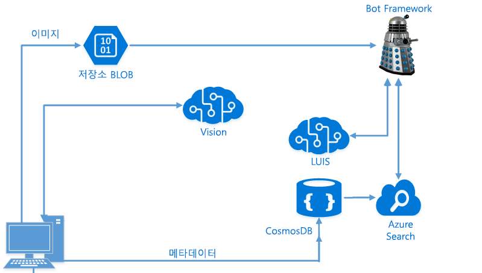

# LUIS 및 Azure Search를 사용하여 지능형 응용 프로그램 개발

이 실습 랩에서는 Microsoft Bot Framework, Azure Search 및 Microsoft LUIS(Language Understanding Intelligent Service)를 사용하여 종단 간 지능형 봇을 만드는 방법을 안내합니다.

> **【08/15/2018】 중요 참고 사항!**
> Bot Framework용 v4 SDK가 최근에 [공개 미리 보기](https://github.com/Microsoft/botbuilder-dotnet) 단계로 전환되었습니다. GA(일반 공급) 시점은 알려지지 않았습니다. v3 SDK 대신 v4 SDK를 사용하여 lab02.2-building_bot을 완료하려는 경우를 위해 2.2에 대한 기본 랩을 만들었습니다.
> 이러한 자료를 자가 학습이 아닌 수업의 일부로 사용하는 경우 **강사의 안내를 따르십시오**.
> 이 과정을 재전달하는 강사이며 질문이 있는 경우 learnanalytics@microsoft.com에 전자 메일을 보내주십시오.

## 목표
이 워크샵에서는 다음과 같은 내용을 다룹니다.
- 응용 프로그램 내에서 긍정적인 검색 경험을 제공하도록 Azure Search 기능을 구현하는 방법 이해
- LUIS 및 Azure Search를 활용하는 Microsoft Bot Framework를 사용하여 지능형 봇 빌드
- 정규식 및 Scorable Groups를 사용하여 봇의 효율성 향상

## 사전 요건

이 워크샵은 Azure의 AI 개발자를 위한 것입니다. 짧은 워크샵이므로 시작 전에 충족되어야 하는 사항들이 있습니다.

첫째, Visual Studio를 사용한 경험이 있어야 합니다. 워크샵에서 빌드하는 모든 것에 Visual Studio가 사용되므로 응용 프로그램을 만들기 위한 [사용 방법](https://docs.microsoft.com/ko-kr/visualstudio/ide/visual-studio-ide)을 숙지하고 있어야 합니다. 또한 이 워크샵은 응용 프로그램 코딩 또는 개발 방법을 가르치는 수업이 아니며, C#에서 코딩하는 방법([여기](https://mva.microsoft.com/ko-kr/training-courses/c-fundamentals-for-absolute-beginners-16169?l=Lvld4EQIC_2706218949)에서 학습할 수 있음)은 알고 있지만 고급 검색 및 NLP(자연어 처리) 솔루션을 구현하는 방법은 알지 못한다고 가정합니다.

둘째, Microsoft의 Bot Framework를 사용하여 봇을 개발한 경험이 있어야 합니다. 봇 디자인 방법이나 대화 상자 작동 방식에 대해 설명하는 데는 많은 시간을 할애하지 않습니다. Bot Framework에 익숙하지 않은 경우 워크샵에 참가하기 전에 [이 Microsoft Virtual Academy 과정](https://mva.microsoft.com/ko-kr/training-courses/creating-bots-in-the-microsoft-bot-framework-using-c-17590#!)을 수강해야 합니다.

셋째, 포털을 사용한 경험이 있으며 Azure에서 리소스를 만들고 비용을 지출할 수 있어야 합니다. 이 워크샵에서는 Azure Pass를 제공하지 않습니다.

>**참고** 이 워크샵은 Visual Studio Community Version 15.4.0을 사용하여 DSVM(Data Science Virtual Machine)에서 개발 및 테스트되었습니다.

## 소개

이 워크샵에서는 사진을 가져오고, Cognitive Services를 사용하여 이미지에서 개체와 사람을 찾고, 그 사람들의 감정을 파악하고, 이러한 모든 데이터를 NoSQL Store(CosmosDB)에 저장하는 종단 간 시나리오를 빌드합니다. NoSQL Store를 사용하여 Azure Search 인덱스를 채운 다음, 쉬운 대상 쿼리가 가능하도록 LUIS를 사용해 Bot Framework 봇을 빌드하겠습니다.

> **참고** 이 랩은 이 워크샵 앞부분의 다양한 랩(Computer Vision, Azure Search, LUIS)에서 얻은 몇 가지 결과를 결합합니다. 위에 나열된 랩을 완료하지 않은 경우 더 진행하기 전에 Azure Search 및 LUIS 랩을 완료해야 합니다. 또는 동료의 Azure Search/LUIS 랩 키를 사용하도록 요청할 수 있습니다.

## 아키텍처

이전 랩에서는 로컬 드라이브에서 사진을 수집한 다음 [Computer Vision](https://www.microsoft.com/cognitive-services/ko-kr/computer-vision-api) Cognitive Service를 호출하여 해당 이미지에 대한 태그와 설명을 얻는 단순한 C# 응용 프로그램을 빌드했습니다.

이 데이터를 수집한 후 처리하고 필요한 모든 정보를 Microsoft [NoSQL](https://en.wikipedia.org/wiki/NoSQL) [PaaS](https://azure.microsoft.com/ko-kr/overview/what-is-paas/) 제품인 [CosmosDB](https://azure.microsoft.com/ko-kr/services/documentdb/)에 저장했습니다.

CosmosDB에 데이터를 저장한 다음 이를 기반으로 [Azure Search](https://azure.microsoft.com/ko-kr/services/search/) 인덱스를 만들었습니다. 다음으로, 데이터를 쿼리할 [Bot Framework](https://dev.botframework.com/)를 빌드하겠습니다. 또한 쿼리에서 의도를 자동으로 도출하고 이를 바탕으로 지능적으로 검색을 수행하도록 [LUIS](https://www.microsoft.com/cognitive-services/ko-kr/language-understanding-intelligent-service-luis)를 사용하여 이 봇을 확장하겠습니다.

> 이 랩은 이 [Cognitive Services 자습서](https://github.com/noodlefrenzy/CognitiveServicesTutorial)의 내용을 바탕으로 하여 적절히 수정되었습니다.

## GitHub 탐색 ##

[resources](./resources) 폴더에는 다음과 같은 여러 디렉터리가 있습니다.

- **assets**, **case**, **instructor**: 이 랩에서는 이러한 폴더를 무시해도 됩니다.
- **code**: 여기에는 우리가 사용할 몇 가지 디렉터리가 있습니다.
	- **Models**: 이러한 클래스는 PictureBot에 검색을 추가할 때 사용됩니다.
	- **Finished-PictureBot_Regex**: 여기에는 Regex 관련 추가 항목을 포함하는 완성된 PictureBot.sln이 있습니다. 작업이 뒤처지거나 막히면 이를 참조할 수 있습니다.
	- **Finished-PictureBot_Search**: 여기에는 Regex 및 Search 관련 추가 항목을 포함하는 완성된 PictureBot.sln이 있습니다. 작업이 뒤처지거나 막히면 이를 참조할 수 있습니다.
	- **Finished-PictureBot_LUIS**: 여기에는 Regex, LUIS 및 Azure Search 관련 추가 항목을 포함하는 완성된 PictureBot.sln이 있습니다. 작업이 뒤처지거나 막히면 이를 참조할 수 있습니다.

> 이러한 랩을 실행하려면 Visual Studio가 필요하지만 워크샵 중 하나에서 Windows Data Science Virtual Machine을 이미 배포한 경우 이를 사용할 수 있습니다.

## 키 수집

이 랩에서는 다양한 키를 수집합니다. 워크샵 전반에서 쉽게 액세스할 수 있도록 모든 키를 텍스트 파일에 저장하는 것이 좋습니다.

> _키_
>- LUIS API:
>- Cosmos DB 연결 문자열:
>- Azure Search 이름:
>- Azure Search 키:
>- Bot Framework 앱 이름:
>- Bot Framework 앱 ID:
>- Bot Framework 앱 암호:

## 랩 탐색

이 워크샵은 다음 5개 섹션으로 나뉩니다.
- [1_Regex_and_ScorableGroups](./1_Regex_and_ScorableGroups.md): 여기서는 정규식과 Scorable Groups를 사용하여 단순한 봇을 빌드합니다.
- [2_Azure_Search](./2_Azure_Search.md): Azure Search를 사용하도록 봇을 구성하고 이전 랩의 Azure Search 서비스에 봇을 연결합니다.
- [3_LUIS](./3_LUIS): 다음으로, Regex를 통해 사용자의 의도를 인식하지 못하는 경우 LUIS를 호출할 수 있도록 LUIS 모델을 봇에 통합합니다.
- [4_Publish_and_Register](./4_Publish_and_Register.md): 마지막으로, 봇을 게시하고 등록합니다.
- [5_Challenge_and_Closing](./5_Challenge_and_Closing.md): 모든 랩을 마쳤으면 이 챌린지를 시도하십시오. 또한 수행한 작업에 대한 요약과 자세한 내용을 알아볼 수 있는 위치도 확인할 수 있습니다.

### [1_Regex_and_ScorableGroups](./1_Regex_and_ScorableGroups.md)로 계속 진행

