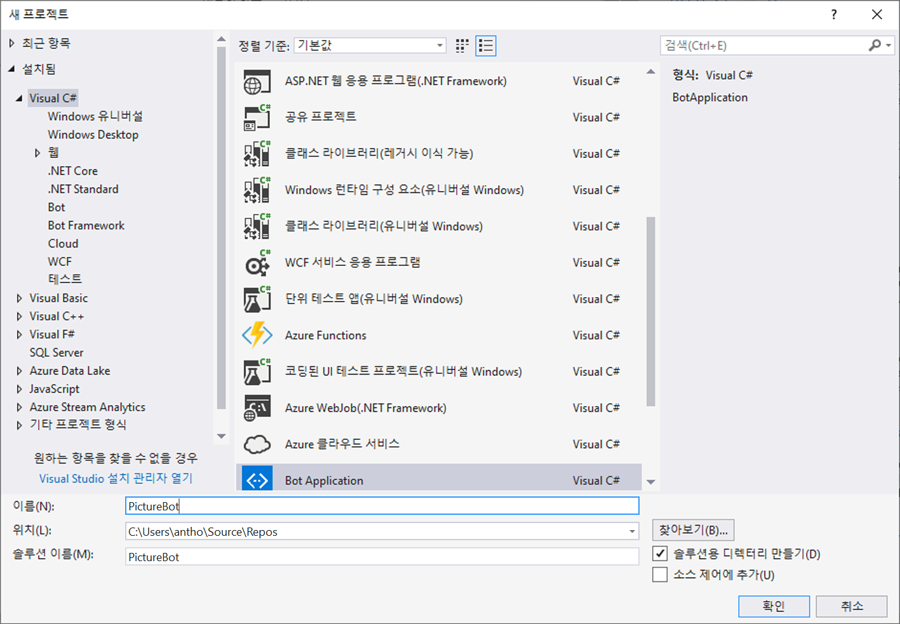
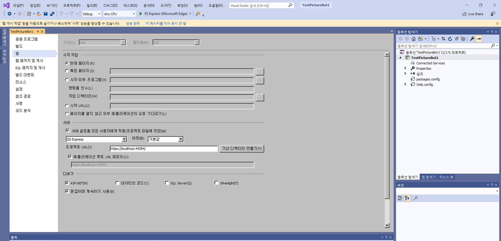

## 1_정규식 및 채점가능한 그룹:
예상 시간: 10-15분

## 봇 빌드

Bot Framework를 사용해본 경험이 있을 줄로 생각하는데, 그렇다면 잘 된 일이고 그렇지 않더라도 너무 염려할 필요 없습니다. 이 섹션에서 많은 것을 배울 수 있습니다. [이 Microsoft Virtual Academy 과정](https://mva.microsoft.com/ko-kr/training-courses/creating-bots-in-the-microsoft-bot-framework-using-c-17590#!)을 이수하고 [설명서](https://docs.microsoft.com/ko-kr/bot-framework/)를 살펴보시기 바랍니다.

### 랩 1.1: 봇 개발 준비

우리는 C# SDK를 사용하여 봇을 개발할 것입니다.  시작하려면 다음 두 가지가 필요합니다.
1. [여기](http://aka.ms/bf-bc-vstemplate)에서 Bot Framework 프로젝트 템플릿을 다운로드합니다.  이 파일은 "Bot Application.zip"이라고 하며 \Documents\Visual Studio 2017\Templates\ProjectTemplates\Visual C#\ 디렉터리에 저장해야 합니다.  압축된 전체 파일을 이 디렉터리에 놓으면 되며, 압축을 풀 필요가 없습니다.  
2. 로컬에서 봇을 테스트하도록 [여기](https://github.com/Microsoft/BotFramework-Emulator/releases/download/v3.5.33/botframework-emulator-Setup-3.5.33.exe)에서 Bot Framework Emulator를 다운로드합니다.  이 에뮬레이터는 브라우저에 따라 `c:\Users\`_your-username_`\AppData\Local\botframework\app-3.5.33\botframework-emulator.exe` 또는 Downloads 폴더에 설치됩니다.

### 랩 1.2: 단순한 봇 만들기 및 실행

Visual Studio에서 파일 --> 새 프로젝트로 이동하여 "PictureBot"이라는 봇 응용 프로그램을 만듭니다. "PictureBot"으로 이름을 지정해야 합니다. 그러지 않으면 나중에 문제가 발생할 수 있습니다.  

 

>**단순한 봇 만들기 및 실행** 랩의 나머지 부분은 선택 사항입니다. 전제 조건에 따라 Bot Framework를 사용한 경험이 있어야 합니다. F5 키를 눌러 올바르게 빌드된 것을 확인한 후 다음 랩으로 이동할 수 있습니다.

메시지를 반복하고 문자 길이를 알려주는 에코 봇인 샘플 봇 코드를 살펴봅니다.  특히 다음 사항을 참고하십시오.
+ App_Start 아래의 **WebApiConfig.cs** 에서 경로 템플릿은 api/{controller}/{id}(id는 선택 사항)입니다.  이 때문에 봇의 끝점을 호출할 때 항상 끝에 api/messages를 추가합니다.  
+ Controllers 아래의 **MessagesController.cs** 는 봇으로의 진입점입니다. 봇은 다양한 활동 유형에 응답할 수 있으며 메시지를 보내면 RootDialog가 호출됩니다.  
+ Dialogs 아래의 **RootDialog.cs** 에서 "StartAsync"는 사용자의 메시지를 기다리는 진입점이며, "MessageReceivedAsync"는 받은 메시지를 처리한 후 추가 메시지를 기다리는 메서드입니다.  "context.PostAsync"를 사용하여 봇에서 사용자에게 메시지를 다시 보낼 수 있습니다.  

F5 키를 클릭하여 샘플 코드를 실행합니다.  적절한 종속 항목을 다운로드하는 것은 NuGet을 통해 처리됩니다.  

코드는 기본 웹 브라우저를 사용하여 http://localhost:3979/와 유사한 URL에서 시작됩니다.  

> 참고: 왜 이 포트 번호를 사용할까요?  이는 프로젝트 속성에서 설정됩니다.  솔루션 탐색기에서 "속성"을 두 번 클릭하고 "웹" 탭을 선택합니다.  프로젝트 URL은 "서버" 섹션에 설정되어 있습니다.  

 

프로젝트가 여전히 실행 중인지 확인하고(프로젝트 속성을 보기 위해 중지한 경우 F5 키를 다시 누름) Bot Framework Emulator를 시작합니다.  방금 설치한 경우 아직 인덱싱되지 않아 로컬 컴퓨터에서 검색에 표시되지 않을 수 있습니다. c:\User\User\AppData\Local\botframework\app-3.5.27\botframework-emulator.exe에 설치된다는 점을 기억하십시오.  봇 URL이 위에서 코드가 시작된 포트 번호와 일치하고 끝에 api/messages가 추가되어 있어야 합니다.  봇과 대화할 수 있습니다.  

 


### 랩 1.3: 정규식 및 Scorable Groups

봇을 개선하기 위해 할 수 있는 일이 여러 가지 있습니다. 우선, 봇이 사용자로부터 상당히 자주 수신하는 간단한 "안녕하세요" 인사말을 위해 LUIS를 호출하는 것은 좋지 않습니다.  단순한 정규식이 이와 일치할 수 있으며 네트워크 대기 시간으로 인한 시간과 LUIS 서비스를 호출하는 데 드는 비용을 줄여 줍니다.  

또한 봇의 복잡성이 증가하는 동시에, 사용자의 입력을 받고 다양한 서비스를 사용하여 해석하기 때문에 이 흐름을 관리하는 프로세스가 필요합니다.  예를 들어 정규식을 먼저 시도하고 일치하지 않는 경우 LUIS를 호출하고, 이후에는 [QnA Maker](http://qnamaker.ai) 및 Azure Search 등의 다른 서비스를 사용해 볼 수 있습니다.  이를 관리하는 좋은 방법은 [ScorableGroups](https://blog.botframework.com/2017/07/06/Scorables/)를 사용하는 것입니다.  ScorableGroups는 이러한 서비스 호출에 순서를 설정하는 특성을 제공합니다.  코드에서 먼저 정규식과 일치시킨 다음, 발화 해석을 위해 LUIS를 호출하고, 마지막으로 일반적인 "무슨 말씀이신지 잘 모르겠습니다." 같은 응답을 제시하는 순서를 설정해 보겠습니다.    

ScorableGroups를 사용하려면 RootDialog가 LuisDialog 대신 DispatchDialog에서 상속해야 합니다(하지만 클래스에서 LuisModel 특성을 여전히 가질 수 있음).  또한 Microsoft.Bot.Builder.Scorables(및 기타)에 대한 참조가 필요합니다.  따라서 RootDialog.cs 파일에 다음을 추가합니다.

```csharp

using Microsoft.Bot.Builder.Scorables;
using System.Collections.Generic;

```

그리고 클래스 파생을 다음으로 변경합니다.

```csharp

    public class RootDialog : DispatchDialog<object>

```

다음으로 클래스의 두 기존 메서드(StartAsync 및 MessageReceivedAsync)를 삭제합니다. 

ScorableGroup 0의 첫 번째 우선 순위로 정규식과 일치하는 몇 가지 새로운 메서드를 추가해 보겠습니다.  RootDialog 클래스의 시작 부분에 다음을 추가합니다.

```csharp

        [RegexPattern("^Hello|hello")]
        [RegexPattern("^Hi|hi")]
        [ScorableGroup(0)]
        public async Task Hello(IDialogContext context, IActivity activity)
        {
            await context.PostAsync("Hello from RegEx!  I am a Photo Organization Bot.  I can search your photos, share your photos on Twitter, and order prints of your photos.  You can ask me things like 'find pictures of food'.");
        }

        [RegexPattern("^Help|help")]
        [ScorableGroup(0)]
        public async Task Help(IDialogContext context, IActivity activity)
        {
            // 단추 메뉴로 도움말 대화 상자를 시작합니다.  
            List<string> choices = new List<string>(new string[] { "Search Pictures", "Share Picture", "Order Prints" });
            PromptDialog.Choice<string>(context, ResumeAfterChoice, 
                new PromptOptions<string>("How can I help you?", options:choices));
        }

        private async Task ResumeAfterChoice(IDialogContext context, IAwaitable<string> result)
        {
            string choice = await result;
            
            switch (choice)
            {
                case "Search Pictures":
                    // PromptDialog.Text(context, ResumeAfterSearchTopicClarification,
                    //     "What kind of picture do you want to search for?");
                    break;
                case "Share Picture":
                    //await SharePic(context, null);
                    break;
                case "Order Prints":
                    //await OrderPic(context, null);
                    break;
                default:
                    await context.PostAsync("I'm sorry. I didn't understand you.");
                    break;
            }
        }

```

이 코드는 "안녕하세요", "안녕하십니까"및 "도움말"로 시작하는 사용자의 표현과 일치시킵니다.  F5 키를 선택하고 봇을 테스트합니다. 그리고 사용자가 도움을 요청할 때, 봇이 할 수 있는 3가지 핵심 작업인 사진 검색, 사진 공유, 인쇄물 주문에 대한 간단한 단추 메뉴를 표시합니다.  

> 참고: 봇이 할 수 있는 일에 대한 명확한 옵션의 메뉴를 얻기 위해 사용자가 "도움말"을 입력할 필요가 없이, 봇과 처음 접촉할 때 기본 환경에 이것이 포함되어야 한다고 생각할 수 있습니다. **검색 기능**, 즉 봇이 할 수 있는 일을 사용자가 알도록 하는 것은 봇의 최대 과제 중 하나입니다.  적절한 [봇 디자인 원칙](https://docs.microsoft.com/ko-kr/bot-framework/bot-design-principles)이 도움이 될 수 있습니다.   

이 설정을 사용하면 정규식이 일치하지 않을 경우 두 번째 시도로 Scorable Group 1에서 LUIS를 사용할 때(나중에) 더 쉬워집니다.  


### [2_Azure_Search](./2_Azure_Search.md)로 계속 진행  
[README](./0_README.md)로 돌아가기
