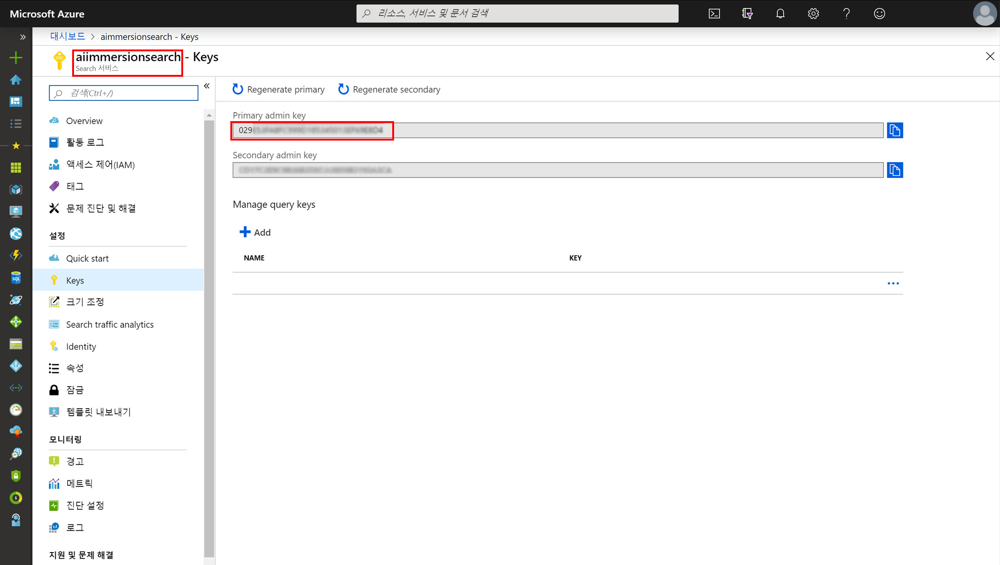
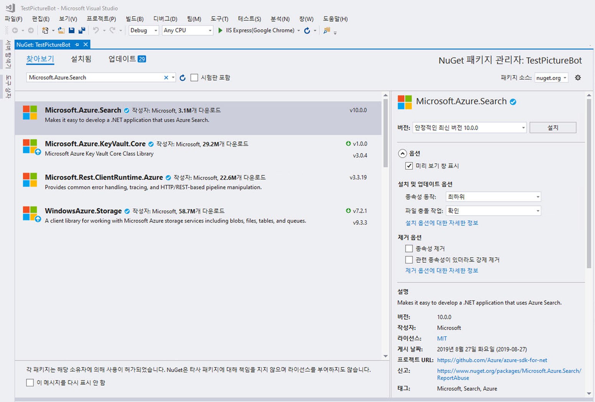

## 2_Azure_Search:
예상 시간: 10-15분

### 랩 2.1: Azure Search를 사용하도록 봇 구성 

먼저 Azure Search 인덱스에 연결하기 위한 관련 정보를 봇에 제공해야 합니다.  연결 정보를 저장하는 가장 좋은 위치는 구성 파일입니다.  

Web.config를 열고 appSettings 섹션에서 다음을 추가합니다.

```xml    
    <!-- Azure Search Settings -->
    <add key="SearchDialogsServiceName" value="" />
    <add key="SearchDialogsServiceKey" value="" />
    <add key="SearchDialogsIndexName" value="images" />
```

SearchDialogsServiceName의 값을 앞에서 만든 Azure Search 서비스의 이름으로 설정합니다.  필요한 경우 [Azure Portal](https://portal.azure.com)로 돌아가서 이를 확인합니다.  

SearchDialogsServiceKey의 값을 이 서비스의 키로 설정합니다.  이 값은 [Azure Portal](https://portal.azure.com)의 Azure Search 키 섹션 아래에서 찾을 수 있습니다.  아래 스크린샷에서 SearchDialogsServiceName은 "aiimmersionsearch"이고 SearchDialogsServiceKey는 "375..."입니다.  

 

### 랩 2.2: Azure Search를 사용하도록 봇 업데이트

다음으로 Azure Search를 호출하도록 봇을 업데이트하겠습니다.  먼저 도구-->NuGet Package Manager-->솔루션용 NuGet 패키지 관리를 선택합니다.  검색 상자에 "Microsoft.Azure.Search"를 입력합니다.  해당 라이브러리를 선택하고 프로젝트를 나타내는 확인란을 선택한 후 설치합니다.  다른 종속성 항목도 설치할 수 있습니다. 설치된 패키지에서 "Newtonsoft.Json" 패키지도 업데이트해야 할 수 있습니다.

 

Visual Studio의 솔루션 탐색기에서 프로젝트를 마우스 오른쪽 단추로 클릭하고 추가-->새 폴더를 선택합니다.  "Models"라는 폴더를 만듭니다.  "Models" 폴더를 마우스 오른쪽 단추로 클릭하고 추가-->기존 항목을 선택합니다.  이 작업을 두 번 수행하여 Models 폴더 아래에 다음 두 파일을 추가합니다. 필요한 경우 네임스페이스를 조정하십시오.
1. [ImageMapper.cs](./resources/code/Models/ImageMapper.cs)
2. [SearchHit.cs](./resources/code/Models/SearchHit.cs)

>이 리포지토리의 [resources/code/Models](./resources/code/Models) 아래에서 이러한 파일을 찾을 수 있습니다.

다음으로 Visual Studio의 솔루션 탐색기에서 Dialogs 폴더를 마우스 오른쪽 단추로 클릭하고 추가-->클래스를 선택합니다.  클래스 이름을 "SearchDialog.cs"로 지정합니다. [여기](./resources/code/SearchDialog.cs)에서 콘텐츠를 추가합니다.

방금 추가한 파일의 내용을 검토합니다. 동료와 함께 각 파일이 수행하는 작업을 이야기합니다.

또한 SearchDialog를 호출하도록 RootDialog를 업데이트해야 합니다.  Dialogs 폴더의 RootDialog.cs에서 `ResumeAfterChoice` 메서드 바로 아래에 다음 "ResumeAfter" 메서드를 추가합니다.

```csharp

        private async Task ResumeAfterSearchTopicClarification(IDialogContext context, IAwaitable<string> result)
        {
            string searchTerm = await result;
            context.Call(new SearchDialog(searchTerm), ResumeAfterSearchDialog);
        }

        private async Task ResumeAfterSearchDialog(IDialogContext context, IAwaitable<object> result)
        {
            await context.PostAsync("Done searching pictures");
        }

```

RootDialog.cs에서 다음 줄의 주석(시작 부분의 `//`)도 제거해야 합니다. `PromptDialog.Text(context, ResumeAfterSearchTopicClarification, "What kind of picture do you want to search for?");` within the `ResumeAfterChoice` method.

F5 키를 눌러 봇을 다시 실행합니다.  Bot Emulator에서 "dogs" 또는 "water" 같은 것을 검색해 보십시오.  사진의 태그가 요청될 때 결과가 표시되는지 확인합니다.  


### [3_LUIS](./3_LUIS.md)로 계속 진행  
[README](./0_README.md)로 돌아가기
