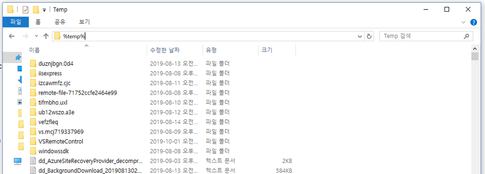

---
lab:
    title: '랩 4: 채팅 로깅'
    module: '모듈 2: 봇 만들기'
---

# 랩 4: 채팅 로깅

> 전제 조건: 이 랩은 [랩 3](../Lab3-Basic_Filter_Bot/02-Basic_Filter_Bot.md)에서 봇을 빌드하고 게시했다는 전제하에 시작됩니다.
이 랩에서 다루는 로깅을 구현할 수 있도록 해당 랩을 완료하는 것이 좋습니다. 완료하지 않은 경우 필요에 따라 모든 연습을 주의 깊게 읽고 일부 코드를 살펴보거나 자체 응용 프로그램에서 사용하는 것으로 충분할 수 있습니다.

## 랩 4.0: 목표
이 워크샵에서는 Microsoft Bot Framework를 사용하여 로깅을 수행하고 채팅 대화의 여러 측면을 저장하는 방법을 보여 줍니다. 이 랩을 완료하면 다음과 같은 역량을 갖추게 됩니다.

- 봇과 사용자 간의 메시지 활동을 가로채고 로깅하는 방법 이해
- 파일 저장소에 발화 로깅

> 참고: 이러한 랩에서는 Microsoft Bot Framework SDK의 v4를 사용합니다. v3 SDK를 사용하여 유사한 랩을 수행하려면 [여기](./other-resources/SDK_V3_Labs)를 참조하십시오.

## 랩 4.1: 메시지 가로채기 및 분석

이 랩에서는 Bot Framework를 통해 봇이 사용자와 나눈 대화에서 데이터를 가로채고 로깅하는 몇 가지 방법을 살펴보겠습니다. 먼저 메모리 솔루션을 구현하지 않고도 메시지와 메시지에 포함된 내용을 확인하는 방법을 알아보겠습니다. 이는 테스트 용도로 좋지만 프로덕션 환경에는 적합하지 않습니다.

다음으로, 대화의 데이터를 파일로 작성하는 방법에 대한 매우 간단한 구현을 살펴보겠습니다. 특히 사용자가 봇에 보내는 메시지를 목록에 넣고 몇 가지 다른 항목과 함께 목록을 임시 파일에 저장합니다(필요에 따라 특정 파일 경로로 변경할 수 있음).

#### Bot Framework Emulator 사용

봇에 아무것도 추가하지 않고 테스트 목적으로 수집할 수 있는 정보를 살펴보겠습니다.

Visual Studio에서 PictureBot.sln을 엽니다. 봇을 게시했기 때문에 로컬에서 변경 내용을 테스트하려면 `PictureBot.bot` 파일에 몇 가지 정보를 추가해야 합니다. 이 파일에는 다음과 같은 내용이 있습니다.

```html
{
  "name": "PictureBot",
  "secretKey": "",
  "services": [
    {
      "appId": "",
      "id": "http://localhost:3978/api/messages",
      "type": "endpoint",
      "appPassword": "",
      "endpoint": "http://localhost:3978/api/messages",
      "name": "PictureBot"
    }
  ]
}
```

이는 v4 SDK용 템플릿으로 시작할 때 파일에 포함되는 내용입니다. 봇을 게시한 Azure Bot Service에 대한 `appId` 및 `appPassword`를 추가하기만 하면 됩니다. 지금 추가하십시오.

이전 랩에서와 마찬가지로 봇을 실행하고 Bot Framework Emulator에서 봇을 엽니다.

주의해야 할 몇 가지 사항은 다음과 같습니다.
- 메시지를 클릭하면 오른쪽에서 "Inspector-JSON" 도구와 연결된 JSON을 볼 수 있습니다. 메시지를 클릭하고 JSON을 검토하여 얻을 수 있는 정보를 확인합니다.
- 오른쪽 하단에 있는 "로그"에는 대화의 전체 로그가 포함되어 있습니다. 조금 더 깊이 살펴보겠습니다.
    - 가장 먼저 볼 수 있는 것은 에뮬레이터가 수신하는 포트입니다.
    - 또한 ngrok가 수신하는 위치도 확인할 수 있으며 "ngrok 트래픽 검사기"링크를 사용하여 ngrok에 대한 트래픽을 검사할 수 있습니다. 그러나 로컬 주소를 선택하면 ngrok을 바이패스할 수 있습니다. **원격 테스트는 이 워크샵에서 다루지 않으므로 ngrok는 여기에 정보 전달용으로 포함되어 있습니다.**
    - 호출에 오류가 있는 경우(POST 200 또는 POST 201 응답 이외의 응답) 오류를 클릭하고 "Inspector-JSON"에서 매우 자세한 로그를 볼 수 있습니다. 어떤 오류인지에 따라, 코드를 거치면서 오류가 발생한 위치를 지적하는 스택 추적을 얻을 수도 있습니다. 이 기능은 봇 프로젝트를 디버깅할 때 매우 유용합니다.
    - 또한 LUIS를 호출할 때는 `Luis Trace`가 있습니다. `추적` 링크를 클릭하면 LUIS 정보를 볼 수 있습니다. 이 랩에서는 설정되지 않았습니다.


에뮬레이터를 사용한 테스트, 디버깅 및 로깅에 대한 자세한 내용은 [여기](https://docs.microsoft.com/ko-kr/azure/bot-service/bot-service-debug-emulator?view=azure-bot-service-4.0)에서 확인할 수 있습니다.

## 랩 4.2: 파일에 로깅

> 참고: 이 랩에서 언급한 몇 가지 모범 사례를 확인하기 위해 [설명서의 지침](https://docs.microsoft.com/ko-kr/azure/bot-service/bot-builder-howto-v4-state?view=azure-bot-service-4.0&tabs=csharp#file-storage)을 참조했습니다.

메모리 저장소 공급자는 봇을 다시 시작할 때 삭제되는 메모리 내 저장소를 사용합니다. 이는 테스트 목적으로만 적합합니다. 데이터를 유지하지만 봇을 데이터베이스에 연결하지 않으려면 파일 저장소 공급자를 사용할 수 있습니다. 이 공급자는 테스트 목적으로도 사용되지만 상태 데이터를 검사할 수 있도록 파일로 유지합니다. 데이터는 JSON 형식을 사용하여 파일로 기록됩니다.

모든 메시지에 이 프로세스를 사용하려고 하므로 Startup 클래스의 `ConfigureServices` 메서드를 사용하여 파일에 저장 정보를 추가합니다. 이 파일을 엽니다. 현재 다음이 사용되고 있습니다.

```csharp
IStorage dataStore = new MemoryStorage();
```

with

```csharp
middleware.Add(new UserState<UserData>(dataStore));
middleware.Add(new ConversationState<ConversationInfo>(dataStore));
```

현재 구현은 메모리 내 저장소를 사용하는 것입니다. 다시 말하지만, 이 메모리 저장소는 로컬 봇 디버깅에만 권장됩니다. 봇이 다시 시작되면 메모리에 저장된 모든 것이 사라집니다.

임시 파일에 정보를 저장하려면 현재 `IStorage` 줄을 다음과 같은 것으로 바꿔야 합니다.

```csharp
IStorage dataStore = new FileStorage(System.IO.Path.GetTempPath());
```

위의 코드를 추가하고 봇을 실행합니다. 에뮬레이터에서 봇과의 샘플 대화를 진행합니다.

다음으로 봇을 중지하고 Windows 바탕 화면에서 파일 탐색기를 엽니다. 위치 표시줄에서 `%temp%`를 입력하고 Enter 키 누릅니다. 그러면 임시 파일 위치로 이동합니다. 최근 항목이 맨 위에 있도록 내용을 정렬하는 것이 좋습니다.

찾고 있는 두 파일은 "conversation"과 "user"로 시작됩니다.



파일의 내용을 검사합니다(VSCode, Visual Studio, 메모장 또는 다른 JSON 편집기/뷰어 사용). 어떤 내용이 있습니까? 예상한 내용 중 없는 것은 무엇입니까?

## 랩 4.3: 파일에 발화 로깅

이 랩에서는 "user" 파일만 업데이트하는 데 중점을 둡니다.

다음으로 사용자가 봇에 보내는 실제 발화를 추가할 수 있습니다. 이 기능은 사용자가 봇과 수행하려는 대화 및 작업 유형을 결정하는 데 유용할 수 있습니다.

PictureState.cs의 `UserData` 개체에 저장된 내용을 업데이트하고 PictureBot.cs의 해당 개체에 정보를 추가하여 이 작업을 수행할 수 있습니다.

PictureState.cs에서 아래 코드 **다음에**

```csharp
public class UserData
    {

        public string Greeted { get; set; } = "not greeted";
```

다음을 추가합니다.

```csharp
// 사용자가 봇에게 말한 내용 목록
public List<string> UtteranceList { get; private set; } = new List<string>();

```

위에서는 단지 사용자가 봇에 보내는 메시지 목록을 저장하는 목록을 만들었습니다.

이 예제에서는 상태 관리자를 사용하여 데이터를 읽고 쓰도록 선택했지만 [상태 관리자를 사용하지 않고 저장소에서 직접 읽고 쓸 수도](https://docs.microsoft.com/ko-kr/azure/bot-service/bot-builder-howto-v4-storage?view=azure-bot-service-4.0&tabs=csharpechorproperty%2Ccsetagoverwrite%2Ccsetag) 있습니다.


> 저장소에 직접 쓰기로 선택한 경우 시나리오에 따라 eTag를 설정할 수 있습니다. eTag 속성을 `*`로 설정하면 봇의 다른 인스턴스가 이전에 작성된 데이터를 덮어쓸 수 있어 마지막 데이터가 기록됩니다. 여기서는 살펴보지 않지만 [동시성 관리에 대한 자세한 내용](https://docs.microsoft.com/ko-kr/azure/bot-service/bot-builder-howto-v4-storage?view=azure-bot-service-4.0&tabs=csharpechorproperty%2Ccsetagoverwrite%2Ccsetag#manage-concurrency-using-etags)을 확인할 수 있습니다.

봇을 실행하기 전에 마지막으로 `OnTurn` 작업을 사용하여 목록에 메시지를 추가해야 합니다. PictureBot.cs를 엽니다.

PictureBot.cs에서 아래 코드 **다음에**

```csharp
public async Task OnTurn(ITurnContext context)
{

    if (context.Activity.Type is ActivityTypes.Message)
    {
        // 턴 컨텍스트에서 사용자 및 대화 상태를 가져옵니다.
        var state = UserState<UserData>.Get(context);
        var conversationInfo = ConversationState<ConversationInfo>.Get(context);
```

다음을 추가합니다.

```csharp
var utterance = context.Activity.Text;
state.UtteranceList.Add(utterance);
```

첫 번째 줄은 사용자로부터 들어오는 메시지를 가져와 `utterance`라는 변수에 저장합니다. 다음 줄은 PictureState.cs에 만든 기존 목록에 utterance를 추가합니다.

봇을 실행하고 봇과 샘플 대화를 합니다. 봇을 중지하고 "user"로 시작되는 최신 임시 파일을 확인합니다. 현재 어떤 내용을 볼 수 있습니까?


> 문제가 발생할 경우 [/code/PictureBot-FinishedSolution-File](./code/PictureBot-FinishedSolution-File)에서 이 지점까지 발생하는 랩 문제에 대한 해결 방법을 찾을 수 있습니다. `appsettings.json` 파일에 Azure Bot Service의 키를 삽입해야 합니다. 이 코드는 실행할 해결 방법이 아닌 참조로 사용하는 것이 좋지만, 실행하려는 경우 필요한 키를 추가해야 합니다(이 섹션에서는 필요 없음).


## 다음 단계

원격 저장소 및 테스트를 로깅 솔루션에 통합하려면 이 솔루션을 기반으로 하는 다음과 같은 자가 주도 자습서를 살펴보십시오. [Azure Storage 추가](https://github.com/Azure/LearnAI-Bootcamp/blob/master/lab02.5-logging_chat_conversations/2_Azure.md) 및 [Cosmos에 데이터 저장](https://github.com/Azure/LearnAI-Bootcamp/blob/master/lab02.5-logging_chat_conversations/3_Cosmos.md).
