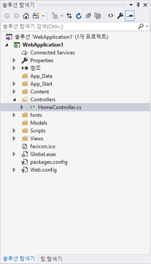
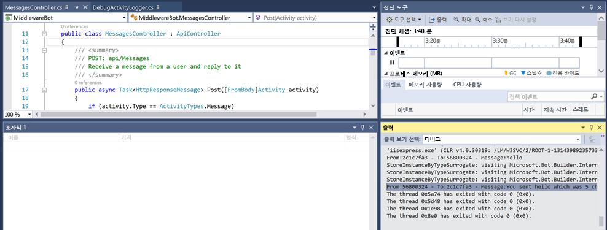

# 활동 로거

## 1. 목표

이 랩의 목적은 Microsoft Bot Framework를 사용하여 로깅을 시작하는 것입니다. 특히 이 랩에서는 활동 로거를 사용하여 대화를 로깅하는 방법을 설명합니다. 이 랩에서 로깅은 디버그를 사용하여 수행됩니다.

## 2. 설정

Visual Studio에서 code\core-Middleware의 core-Middleware 코드를 가져옵니다. 이를 수행하는 가장 쉬운 방법은 core-Middleware.sln을 여는 것입니다. 솔루션 탐색기는 Visual Studio에서 다음과 같이 표시됩니다.



## 3. IActivityLogger

대화 기록을 사용할 때 가장 일반적인 작업 중 하나는 봇과 사용자 간의 메시지 활동을 가로채고 로깅하는 것입니다. IActivityLogger 인터페이스에는 클래스가 메시지 활동을 로깅하기 위해 구현해야 하는 기능에 대한 정의가 포함되어 있습니다. IActivityLogger 인터페이스의 DebugActivityLogger 구현은 디버그 모드로 실행할 때만 추적 수신기에 메시지 활동을 기록합니다.

````C#
public class DebugActivityLogger : IActivityLogger
{
    public async Task LogAsync(IActivity activity)
    {
        Debug.WriteLine($"From:{activity.From.Id} - To:{activity.Recipient.Id} - Message:{activity.AsMessageActivity().Text}");
    }
}
````
로깅 활동은 봇 응용 프로그램의 수명 동안 이루어지는 이벤트입니다. Application_Start 메서드는 응용 프로그램이 시작될 때 호출되어 응용 프로그램의 수명 동안 유지됩니다.

Global.asax를 사용하면 중요한 수명 주기 이벤트에 응답하는 이벤트 처리기를 작성할 수 있습니다. Global.asax 이벤트는 사용자를 통해 직접 호출되지 않고 응용 프로그램 이벤트에 대한 응답으로 자동으로 호출됩니다. 이 랩에서는 다음과 같이 Application_Start(Global.asax)에서 DebugActivityLogger를 등록해야 합니다.

````C#
protected void Application_Start()
{
    Conversation.UpdateContainer(builder =>
    {
        builder.RegisterType<DebugActivityLogger>().AsImplementedInterfaces().InstancePerDependency();
    });
    GlobalConfiguration.Configure(WebApiConfig.Register);
}
````

Application_Start 메서드는 응용 프로그램의 수명 주기 동안 한 번만 호출됩니다. 이 메서드를 사용하여 시작 작업을 수행할 수 있습니다.

## 4. 로그 결과

봇 응용 프로그램을 실행하고 에뮬레이터에서 메시지를 사용하여 테스트합니다. 로그 데이터는 Debug.WriteLine을 사용하여 작성됩니다. 출력 창을 사용하여 결과를 볼 수 있습니다. *출력 보시 선택* 에서 디버그가 선택되었는지 확인합니다. 출력이 표시되지 않는 경우 메뉴에서 보기->출력을 선택합니다. ````From:56800324 - To:2c1c7fa3 - Message:hello````와 같은 항목이 표시됩니다. 이 봇은 에코 봇이므로 에코 메시지도 로깅된 것을 볼 수 있습니다.



### [2_File_Logger](2_File_Logger.md)로 계속 진행

[0_README](../0_README.md)로 돌아가기