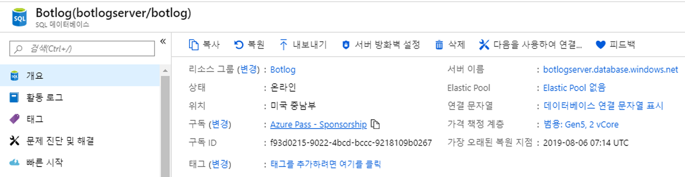
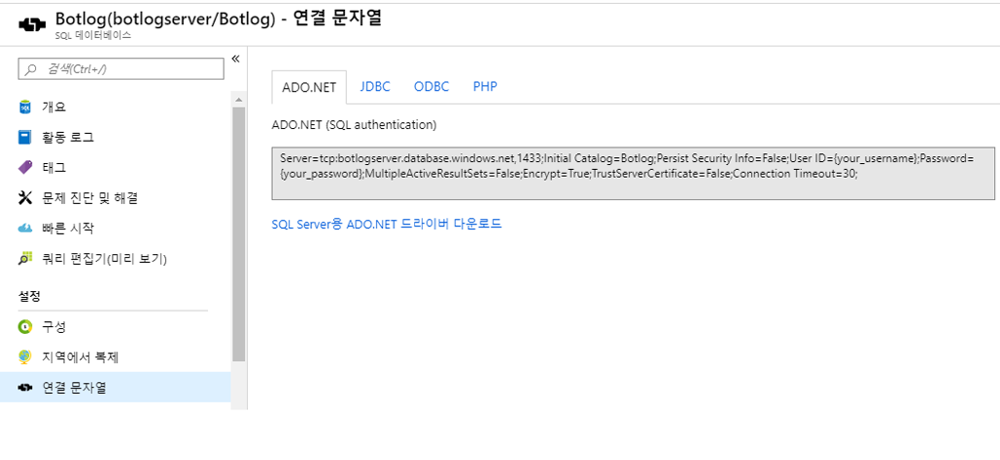
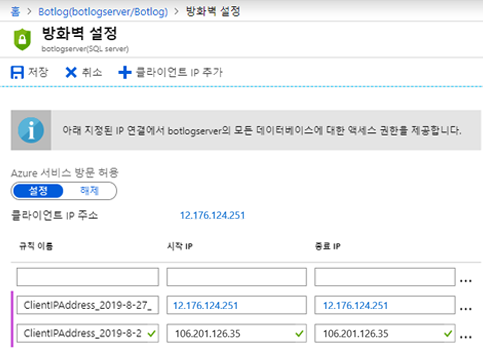
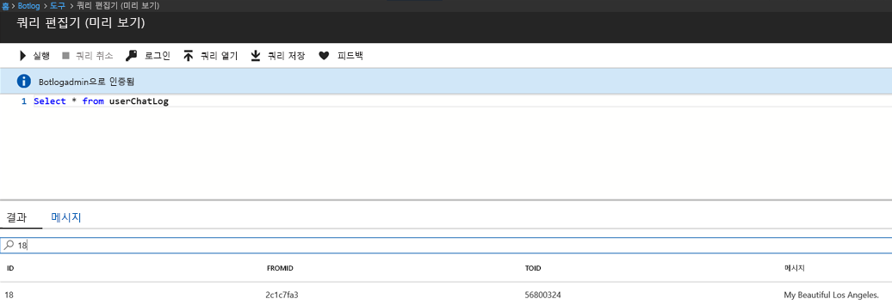

# SQL 로거

## 1.	목표

이 랩의 목적은 Azure SQL Database에 채팅 대화를 로깅하는 것입니다. 이 랩은 Global.asax 이벤트와 LogAsync 메서드를 사용 한 이전 파일 로거 랩의 연장선입니다.

## 2.	설정/사전 요건

2.1.   Visual Studio에서 code\sql-core-Middleware의 프로젝트를 가져옵니다.

2.2.   우리는 SQL Database에 기록할 것이므로 새 데이터베이스를 만들기 위해 Azure Portal로 이동하여 [DB 만들기 - 포털](https://docs.microsoft.com/ko-kr/azure/sql-database/sql-database-get-started-portal) 단계를 따릅니다. 하지만 링크에서 제안된 "MySampleDatabase"가 아닌 Botlog라는 데이터베이스를 만듭니다. 프로세스가 끝나면 아래 이미지에서 볼 수 있듯이 개요 탭이 표시됩니다.



2.2.   개요 탭에서 "데이터베이스 연결 문자열 표시"를 선택하고 나중에 랩에서 사용할 수 있도록 연결 문자열을 기록해 둡니다(텍스트 문서에 붙여 넣음).



2.3.   IP 주소를 캡처하기 위해 방화벽 설정을 변경합니다. [DB 만들기 - 포털](https://docs.microsoft.com/ko-kr/azure/sql-database/sql-database-get-started-portal)의 단계를 수행한 경우 이 작업을 이미 완료했을 수 있습니다. IP 주소는 여기에서 찾을 수 있습니다. https://whatismyipaddress.com/ 



2.4.   아래 table 문(또는 스키마)을 사용하여 userChatLog라는 새 테이블을 만듭니다. [DB 만들기 - 포털](https://docs.microsoft.com/ko-kr/azure/sql-database/sql-database-get-started-portal) 링크의 "SQL Database 쿼리" 섹션에 나온 도구를 그대로 사용합니다. Azure Portal 에서 왼쪽 메뉴의 "데이터 탐색기(미리 보기)"를 클릭합니다. 로그인하려면 데이터베이스를 만들 때 지정한 것과 동일한 계정과 암호를 사용합니다. 아래 스크립트를 붙여 넣고 "실행"을 클릭합니다. 예상 결과는 다음과 같은 메시지입니다. "Query succeeded:" Affected rows: 0.". 

```
CREATE TABLE userChatLog(id int IDENTITY(1, 1),fromId varchar(max),toId varchar(max),message varchar(max),PRIMARY KEY(id));
```

2.5.   Visual Studio에서 sql-core-Middleware의 코드를 가져옵니다. 이 작업을 수행하는 가장 쉬운 방법은 sql-core-Middleware.sln 솔루션을 클릭하는 것입니다.

## 3.  SQL 로깅

프레임워크는 이전 랩에서 사용한 것과 매우 동일합니다. 즉, Global.asax의 글로벌 이벤트를 사용하여 로깅을 설정합니다. 이 작업을 수행하는 이상적인 방법은 Application_Start를 통해 SQL Server에 대한 연결을 시작하고, 연결 개체를 LogAsync 메서드에 전달하여 채팅 메시지를 저장하고, Application_End를 통해 연결을 닫는 것입니다.

````c#
public class WebApiApplication : System.Web.HttpApplication
    {
        SqlConnection connection = null;
        protected void Application_Start()
        {
            // SQL 문자열 연결 설정
            SqlConnectionStringBuilder sqlbuilder = new SqlConnectionStringBuilder();
            sqlbuilder.DataSource = "botlogserver.database.windows.net";
            sqlbuilder.UserID = "botlogadmin";
            sqlbuilder.Password = "�";
            sqlbuilder.InitialCatalog = "Botlog";

            connection = new SqlConnection(sqlbuilder.ConnectionString);
            connection.Open();
            Debug.WriteLine("Connection Success");

            Conversation.UpdateContainer(builder =>
            {
                builder.RegisterType<SqlActivityLogger>().AsImplementedInterfaces().InstancePerDependency().WithParameter("conn", connection);
            });

            GlobalConfiguration.Configure(WebApiConfig.Register);
        }

        protected void Application_End()
        {
            connection.Close();
            Debug.WriteLine("Connection to database closed");
        }
    }
````

위의 코드 조각에서 연결 개체가 SqlActivityLogger에 매개 변수로 전달된다는 점에 주목할 필요가 있습니다. 이를 통해 LogAsync 메서드가 이제 봇 또는 사용자의 메시지를 로깅할 수 있습니다. 채팅 메시지와 함께 from/to id는 활동 개체(activity.From.Id, activity.Recipient.Id, activity.AsMessageActivity().Text)에서 얻을 수 있습니다.

````c#
public class SqlActivityLogger : IActivityLogger
    {
        SqlConnection connection;

        public SqlActivityLogger(SqlConnection conn)
        {
            this.connection = conn;
        }
        public async Task LogAsync(IActivity activity)
        {
                string fromId = activity.From.Id;
                string toId = activity.Recipient.Id;
                string message = activity.AsMessageActivity().Text;

                string insertQuery = "INSERT INTO userChatLog(fromId, toId, message) VALUES (@fromId,@toId,@message)";
                
                // 사용자 채팅 로그 테이블에 fromId, toId, 메시지 전달 
                SqlCommand command = new SqlCommand(insertQuery, connection);
                command.Parameters.AddWithValue("@fromId", fromId);
                command.Parameters.AddWithValue("@toId", toId);
                command.Parameters.AddWithValue("@message", message);
              
                // Azure SQL Database에 삽입
                command.ExecuteNonQuery();
                Debug.WriteLine("Insertion successful of message: " + activity.AsMessageActivity().Text);   
        }
    }
````

### SQL 삽입 

SQL 삽입은 공격자가 응용 프로그램의 데이터베이스 서버를 제어하는 악의적인 SQL 문을 실행할 수 있는 삽입 공격을 말합니다. SQL 삽입은 공격자에게 중요한 데이터에 대한 무단 액세스를 제공할 수 있습니다. LogAsync 메서드에서 매개 변수를 통해 SQL 삽입을 방어할 수 있습니다. 매개 변수화된 쿼리의 주요 이점은 SQL 삽입을 방지하는 것입니다.

## 4.  SQL 쿼리 결과

Visual Studio에서 프로젝트를 실행하고 Bot Emulator를 엽니다. SQL 로깅 기능을 테스트하기 위해 봇에 메시지를 보내기 시작합니다.


포털의 데이터베이스 페이지에서 도구 -> 쿼리 편집기(미리 보기)를 선택하여 테이블에 저장된 로그 메시지를 미리 봅니다. 로그인하여 쿼리를 실행합니다.
이것은 결과를 볼 수 있는 빠른 방법이지만 유일한 방법은 아닙니다. 모든 SQL 클라이언트를 사용하여 쿼리 작업을 수행할 수 있습니다. ````Select * from userChatLog```` 쿼리를 실행하여 userChatLog 테이블에 채팅이 삽입되었는지 확인합니다. 아래 예제에서는 Bot Emulator를 통해 전송된 ````My Beautiful Los Angeles````라는 메시지가 ID와 함께 로깅됩니다.




### 랩을 검토하고 추가 크레딧을 시도하려면 [0_README](../0_README.md)로 계속 진행