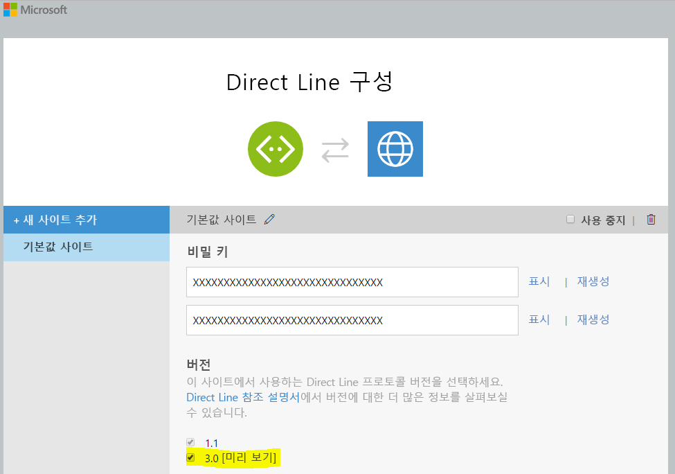
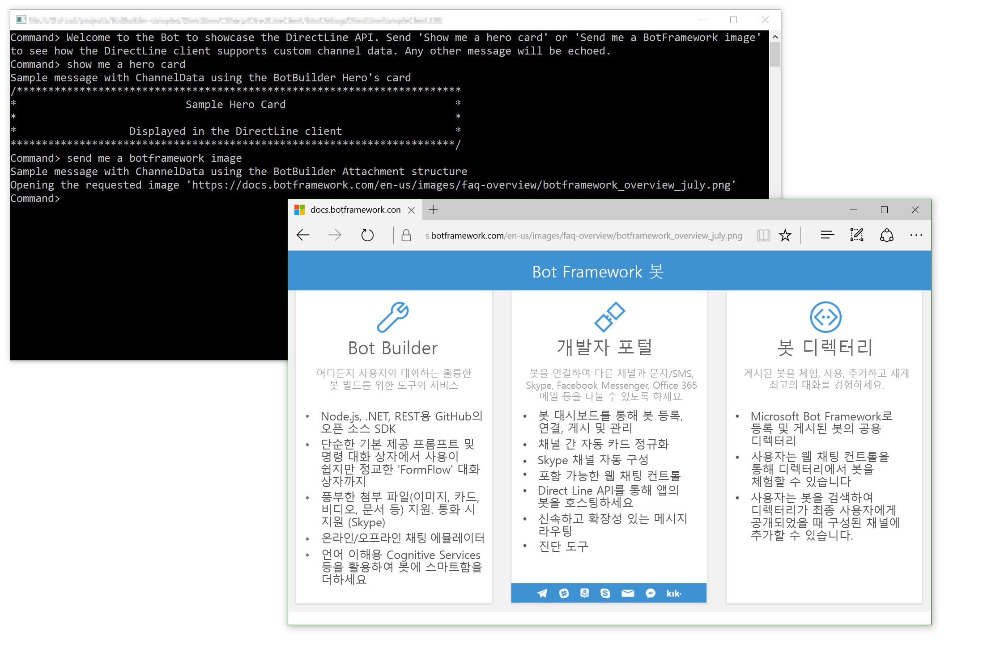

# Direct Line 봇 샘플

Direct Line API를 사용하여 서로 통신하는 샘플 봇 및 사용자 지정 클라이언트입니다.

[![Deploy to Azure][Deploy Button]][Deploy CSharp/DirectLine]

[Deploy Button]: https://azuredeploy.net/deploybutton.png
[Deploy CSharp/DirectLine]: https://azuredeploy.net

### 사전 요건

이 샘플을 실행하기 위한 최소 필수 구성 요소는 다음과 같습니다.
* Visual Studio 2015의 최신 업데이트. [여기](http://www.visualstudio.com)에서 커뮤니티 버전을 무료로 다운로드할 수 있습니다.
* Bot Framework Emulator. Bot Framework Emulator를 설치하려면 [여기](https://emulator.botframework.com/)에서 다운로드합니다. Bot Framework Emulator에 대한 자세한 내용은 [이 설명서 항목](https://github.com/microsoft/botframework-emulator/wiki/Getting-Started)을 참조하십시오.
* Microsoft Bot Framework에 봇을 등록합니다. 관련 지침은 [여기](https://docs.microsoft.com/ko-kr/bot-framework/portal-register-bot)를 참조하십시오. 등록을 완료한 후에는 등록된 구성 값(Bot Id, MicrosoftAppId 및 MicrosoftAppPassword)으로 [봇의 Web.config](DirectLineBot/Web.config#L9-L11) 파일을 업데이트합니다.

#### Direct Line API
Direct Line API에 대한 자격 증명은 Bot Framework 개발자 포털에서 가져와야 하며 호출자가 생성된 봇에만 연결할 수 있도록 허용합니다.
Bot Framework 개발자 포털에서, 채널 목록에서 Direct Line을 사용하도록 설정한 다음 Direct Line 암호를 구성하고 Bot ID와 함께 [클라이언트의 App.config](DirectLineClient/App.config#L4-L5) 파일에서 해당 값을 업데이트합니다. 버전 3.0[미리 보기]에 대한 확인란을 선택해야 합니다. 채널을 구성하는 방법에 대한 자세한 내용은 [여기](https://docs.microsoft.com/ko-kr/bot-framework/portal-configure-channels)를 참조하십시오.



#### 게시
또한 이 샘플을 실행하고 테스트하려면 [봇을 Azure 등에 게시](https://docs.microsoft.com/ko-kr/bot-framework/publish-bot-overview)해야 합니다. 또는 [Ngrok를 사용하여 클라우드에서 로컬 봇과 상호 작용](https://blogs.msdn.microsoft.com/jamiedalton/2016/07/29/ms-bot-framework-ngrok/)할 수 있습니다. 

### 코드 주요 내용

Direct Line API는 단일 봇에 직접 연결하기 위한 단순한 REST API입니다. 이 API는 개발자가 봇과 통신할 고유한 클라이언트 응용 프로그램, 웹 채팅 컨트롤 또는 모바일 앱을 작성하기 위한 것입니다. [Direct Line v3.0 Nuget 패키지](https://www.nuget.org/packages/Microsoft.Bot.Connector.DirectLine/3.0.0-beta)는 기본 REST API에 대한 액세스를 간소화합니다.

Direct Line 채널에서의 각 대화는 `DirectLineClient.Conversations.StartConversationAsync`를 사용하여 명시적으로 시작해야 합니다.
새로운 `DirectLineClient`를 만들고 새 대화를 시작하는 클라이언트의 [Program.cs](DirectLineClient/Program.cs#L25-L27) 클래스를 살펴보십시오.


````C#
DirectLineClient client = new DirectLineClient(directLineSecret);
            
var conversation = await client.Conversations.StartConversationAsync();
````

사용자 메시지는 이전 단계에서 생성된 `ConversationId`를 사용하여 Direct Line 클라이언트 `Conversations.PostActivityAsync` 메서드를 사용하여 봇으로 전송됩니다.

````C#
while (true)
{
    string input = Console.ReadLine().Trim();

    if (input.ToLower() == "exit")
    {
        break;
    }
    else
    {
        if (input.Length > 0)
        {
            Activity userMessage = new Activity
            {
                From = new ChannelAccount(fromUser),
                Text = input,
                Type = ActivityTypes.Message
            };

            await client.Conversations.PostActivityAsync(conversation.ConversationId, userMessage);
        }
    }
}
````

봇의 메시지는 `ReadBotMessagesAsync` 메서드로 다른 스레드를 사용하여 API에서 지속적으로 폴링됩니다. [Program.cs](DirectLineClient/Program.cs#L64-L69)에서 저장된 워터마크보다 더 새로운 대화 메시지를 검색하는 `GetActivitiesAsync` 메서드의 사용을 살펴보십시오. 그런 다음 봇에서만 메시지를 수신하도록 활동이 필터링됩니다.

````C#
var activitySet = await client.Conversations.GetActivitiesAsync(conversationId, watermark);
watermark = activitySet?.Watermark;

var activities = from x in activitySet.Activities
                    where x.From.Id == botId
                    select x;
````

DirectLine v3.0(버전 1.1과 달리)에는 첨부 파일이 지원됩니다(첨부 파일에 대한 자세한 내용은 [메시지에 미디어 첨부 파일 추가](https://docs.microsoft.com/ko-kr/bot-framework/dotnet/bot-builder-dotnet-add-media-attachments) 참조). [Program.cs](DirectLineClient/Program.cs#L75-L92)에서 `ReadBotMessagesAsync` 메서드를 확인하여 첨부 파일이 해당 유형에 따라 적절하게 검색되고 렌더링되는 방법을 확인합니다.


````C#
if (activity.Attachments != null)
{
    foreach (Attachment attachment in activity.Attachments)
    {
        switch (attachment.ContentType)
        {
            case "application/vnd.microsoft.card.hero":
                RenderHeroCard(attachment);
                break;

            case "image/png":
                Console.WriteLine($"Opening the requested image '{attachment.ContentUrl}'");

                Process.Start(attachment.ContentUrl);
                break;
        }
    }
}
````


### 결과

샘플을 실행하려면 봇과 클라이언트 앱을 모두 실행해야 합니다.
* 봇 앱 실행
    1. Visual Studio 솔루션 탐색기 창에서 **DirectLineBot** 프로젝트를 마우스 오른쪽 단추로 클릭합니다.
    2. 상황에 맞는 메뉴에서 디버그를 선택한 다음 새 인스턴스 시작을 선택하고 _웹 응용 프로그램_이 시작될 때까지 기다립니다.
* 클라이언트 앱 실행
    1. Visual Studio 솔루션 탐색기 창에서 **DirectLineSampleClient** 프로젝트를 마우스 오른쪽 단추로 클릭합니다.
    2. 상황에 맞는 메뉴에서 디버그를 선택한 다음 새 인스턴스 시작을 선택하고 _콘솔 응용 프로그램_이 시작될 때까지 기다립니다.

첨부 파일 유형을 테스트하려면 `show me a hero card` 또는 `send me a botframework image`를 입력합니다. 그러면 다음과 같은 결과를 볼 수 있습니다.



### 자세한 정보

Bot Builder for .NET 및 대화를 시작하는 방법에 대한 자세한 내용은 다음 리소스를 검토하십시오.
* [Bot Builder for .NET](https://docs.microsoft.com/ko-kr/bot-framework/dotnet/)
* [Bot Framework FAQ](https://docs.microsoft.com/ko-kr/bot-framework/resources-bot-framework-faq#i-have-a-communication-channel-id-like-to-be-configurable-with-bot-framework-can-i-work-with-microsoft-to-do-that)
* [Direct Line API - v3.0](https://docs.botframework.com/ko-kr/restapi/directline3/)
* [Direct Line v3.0 Nuget 패키지](https://www.nuget.org/packages/Microsoft.Bot.Connector.DirectLine/3.0.0-beta)
* [메시지에 미디어 첨부 파일 추가](https://docs.microsoft.com/ko-kr/bot-framework/dotnet/bot-builder-dotnet-add-media-attachments)
* [Bot Framework Emulator](https://github.com/microsoft/botframework-emulator/wiki/Getting-Started)
