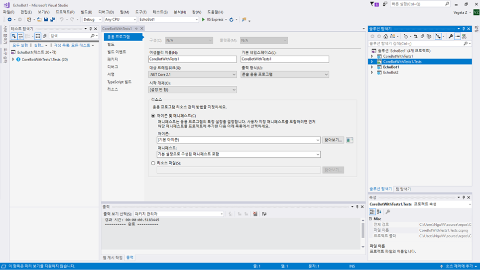
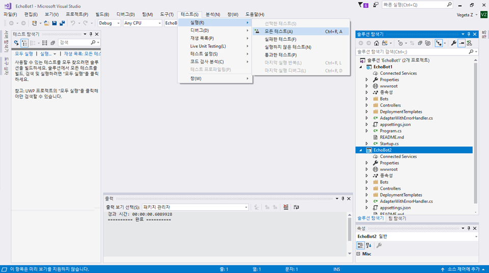

# 단위 테스트 봇

## 1.	목표

Microsoft Bot Framework를 사용하여 코드를 작성하는 것은 재미있고 흥미롭습니다. 그러나 봇의 코딩을 시작하기 전에 코드의 단위 테스트를 고려해야합니다. 챗봇을 테스트하는 데는 전체 환경에 걸친 테스트, 타사 API 통합 등을 비롯한 고유한 과제가 따릅니다. 단위 테스트는 소프트웨어 응용 프로그램의 개별 단위/구성 요소를 테스트하는 소프트웨어 테스트 방법입니다.

단위 테스트는 다음 사항에 도움이 됩니다.

* 기능을 추가하면서 기능 확인
* 개별적으로 구성 요소의 유효성 검사
* 코드에 익숙하지 않은 사용자가 코드 작업 시 코드가 손상되지 않았는지 확인

이 랩의 목표는 Microsoft Bot Framework를 사용하여 개발된 봇에 대한 단위 테스트를 도입하는 것입니다.

## 2.	설정

VisualStudio에서 code\EchoBot의 EchoBot 솔루션을 가져옵니다. 가져오기가 완료되면 아래와 같이 두 개의 프로젝트(봇 응용 프로그램인 EchoBot, 테스트 프로젝트인 EchoBotTests)를 볼 수 있습니다. 



## 3.	Echobot

이 랩에서는 EchoBot을 사용하여 단위 테스트를 개발합니다. EchoBot은 입력된 메시지에 대해 사용자에게 응답하는 매우 단순한 봇입니다. 예를 들어 사용자가 "Hello"를 입력하면 EchoBot은 "You sent: Hello"라는 메시지로 응답합니다. 대화 상자를 사용하는 EchoBot 코드의 핵심을 아래(MessagesController.cs)에서 확인할 수 있습니다. MessageReceivedAsync는 다음을 사용하여 사용자의 메시지를 반복합니다. "You said: "

````c#
public class EchoDialog : IDialog<object>
{
    public async Task StartAsync(IDialogContext context)
    {
        context.Wait(MessageReceivedAsync);
    }

public async Task MessageReceivedAsync(IDialogContext context, IAwaitable<IMessageActivity> argument)
    {
        var message = await argument;
        await context.PostAsync("You said: " + message.Text);
        context.Wait(MessageReceivedAsync);
    }
}
````

## 4.	Echobot - 단위 테스트

복잡한 챗봇을 사용하는 경우 대화 상태와 대화 흐름이 염려될 수 있습니다. 또한 챗봇이 단일 사용자 메시지에 여러 번 응답할 수도 있고 챗봇에게 메시지를 보낸 후에는 즉시 응답을 받지 못할 수도 있습니다. 이러한 복잡성을 감안할 때 단위 테스트와 함께 모의를 사용하는 것이 도움이 될 수 있습니다. 모의는 주로 단위 테스트에 사용됩니다. 테스트 대상 개체는 다른 (복잡한) 개체에 대한 종속성이 있을 수 있습니다. 테스트할 개체의 동작을 격리하려면 다른 개체를 실제 개체의 동작을 시뮬레이션하는 모의 개체로 바꿉니다. 이는 실제 개체를 단위 테스트에 통합하는 것이 불가능한 경우에 유용합니다.

EchoBot 솔루션 내에서 Visual Studio의 *단위 테스트 프로젝트* 를 사용하여 단위 테스트를 만들 수 있습니다. EchoBot.sln을 가져오면 단위 테스트 프로젝트인 EchoBotTests 프로젝트가 표시됩니다. 이 프로젝트에는 대화 상자에 대한 단위 테스트를 개발하는 데 도움이 되는 몇 가지 도우미 클래스(Bot Builder 코드를 다시 사용하여 개발)가 포함되어 있습니다.

* DialogTestBase.cs
* FiberTestBase.cs
* MockConnectorFactory.cs

EchoBotTests.cs 내부에는 *ShouldReturnEcho* 라는 테스트 메서드가 있습니다. *ShouldReturnEcho* 는 EchoBot에서 결과를 확인합니다. EchoBotTests.cs의 아래 줄은 RootDialog를 사용하여 EchoBot의 동작을 모의합니다. RootDialog는 EchoBot의 기능을 제공하는 데 사용됩니다.

````c#
using (new FiberTestBase.ResolveMoqAssembly(rootDialog))
````

아래와 같이 **테스트 -> 실행 -> 모든 테스트** 를 선택하여 모든 테스트를 실행하고 테스트가 성공적으로 실행되는지 확인합니다.



## 5.	일찍 끝났다면 추가 크레딧을 위해 다음을 시도해 보십시오.

A.   에코 프롬프트가 "You sent"로 시작하는지 확인하는 *EchoStartsWith* 라는 또 다른 TestMethod를 작성합니다.

*힌트:* TestMethod는 ShouldReturnEcho()와 매우 유사하며 toUser.Text가 "You sent"로 시작하는지 확인합니다. 

B. 에코된 메시지가 봇에 의해 전송되었는지 확인할 수 있습니까?

*힌트:* 여기에는 받은 IMessageActivity 응답의 속성을 확인하는 작업이 포함됩니다.


 ### [3_Direct_Line_Testing](3_Direct_Line_Testing.md)로 계속 진행

 [README](../0_README.md)로 돌아가기