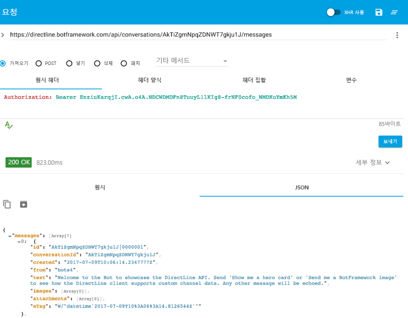

# 봇에 직접 연결 - Direct Line

## 목표

경우에 따라 봇과 직접 통신해야 할 수 있습니다. 예를 들어 호스팅된 봇을 사용하여 기능 테스트를 수행할 수 있습니다. 봇과 사용자 고유의 클라이언트 응용 프로그램 간의 통신은 [Direct Line API](https://docs.microsoft.com/ko-kr/bot-framework/rest-api/bot-framework-rest-direct-line-3-0-concepts)를 사용하여 수행할 수 있습니다. 이 실습 랩에서는 Direct Line API와 관련된 주요 개념을 소개합니다.

## 설정

1. code\core-DirectLine에서 프로젝트를 열고 Visual Studio에서 솔루션을 가져옵니다.

2. DirectLineBot 솔루션에는 다음 두 가지 프로젝트가 있습니다. DirectLineBot과 DirectLineSampleClient가 그것입니다. **(이전 랩에서) 게시된 봇** 을 사용하거나 이 랩의 **DirectLineBot을 게시** 하도록 선택할 수 있습니다.

DirectLineBot을 사용하려면 다음을 수행해야 합니다.

- Azure에 이를 배포합니다. [이 자습서](https://docs.microsoft.com/ko-kr/bot-framework/deploy-dotnet-bot-visual-studio)를 따라 Visual Studio에서 Azure에 직접 .NET 봇을 배포하는 방법을 알아봅니다.

- 다른 사용자가 DirectLineBot을 사용하기 전에 포털에 등록하십시오. 등록 단계는 [등록 지침](https://docs.microsoft.com/ko-kr/bot-framework/portal-register-bot)에서 찾을 수 있습니다.


DirectLineSampleClient는 봇에 메시지를 보낼 클라이언트입니다.

## 인증

Azure Portal의 Direct Line 채널 구성 페이지에서 가져온 암호를 사용하여 Direct Line API 요청을 인증할 수 있습니다. Azure Portal로 이동하여 봇을 찾습니다. "봇 관리" 아래에서 **채널** 을 선택한 다음 "Direct Line"을 선택하여 Direct Line을 추가합니다. "표시"를 선택하고 키를 복사하여 Direct Line 채널 구성 페이지에서 비밀 키를 가져올 수 있습니다.


**보안 범위**

비밀 키: 비밀 키는 응용 프로그램 전체에 적용되며 클라이언트 응용 프로그램에 포함됩니다. 응용 프로그램에서 시작되는 모든 대화가 동일한 암호를 사용하므로 매우 편리합니다.

토큰: 토큰은 대화에 따라 다릅니다. 해당 암호를 사용하여 토큰을 요청하면 해당 토큰으로 대화를 시작할 수 있습니다. 발급된 시점부터 30분 동안 유효하지만 새로 고칠 수 있습니다.

## 웹 구성

다음으로 Azure Portal의 *Direct Line 구성* 에서 얻은 비밀 키를 게시된 봇에 대한 Web.config 파일의 구성 설정에 추가해야 합니다. 또한 봇 ID(봇 핸들이라고도 함), 앱 암호 및 앱 ID를 캡처하여 추가하고 DirectLineSampleClient 프로젝트의 App.config의 appSettings 부분에 입력해야 합니다. App.config에서 입력/편집할 Web.config의 관련 줄은 다음과 같습니다.

```csharp
<add key="DirectLineSecret" value="YourBotDirectLineSecret" />
<add key="BotId" value="YourBotId/" />
<add key="MicrosoftAppId" value="YourAppId" />
<add key="MicrosoftAppPassword" value="YourAppPassword" />
```

## 메시지 보내기 및 받기

Direct Line API를 사용하면 클라이언트가 HTTP Post 요청을 실행하여 봇에 메시지를 보낼 수 있습니다. 클라이언트는 WebSocket 스트림을 통해 또는 HTTP GET 요청을 실행하여 봇으로부터 메시지를 받을 수 있습니다. 이 랩에서는 메시지를 수신하기 위한 HTTP Get 옵션을 살펴봅니다.

1.	구성을 변경한 후 DirectLineSampleClient 프로젝트를 실행합니다.

2.	콘솔을 통해 메시지를 제출하고 대화 ID를 가져옵니다. Program.cs 52번 줄에서 봇과 대화하기 위해 필요한 대화 ID가 출력됩니다.

	````Console.WriteLine("Conversation ID:" + conversation.ConversationId);````

	

3.	대화 ID가 있으면 HTTP Get을 사용하여 사용자 및 봇 메시지를 검색할 수 있습니다. 특정 대화에 대한 메시지를 검색하려면 https://directline.botframework.com/api/conversations/{conversationId}/messages 끝점에 대한 GET 요청을 실행할 수 있습니다. 또한 원시 헤더의 일부로 비밀 키를 전달해야 합니다(예: Authorization: Bearer {secretKey}).

4.	REST 클라이언트를 사용하여 HTTP Get을 통해 메시지를 수신할 수 있습니다. 이 랩에서는 curl 또는 웹 기반 클라이언트를 활용합니다.

	4.1 Curl:

	Curl은 다양한 프로토콜을 사용하여 데이터를 전송하기 위한 명령줄 도구입니다. Curl은 다음 페이지에서 다운로드할 수 있습니다. 	
	https://curl.haxx.se/download.html

	터미널을 열고 curl이 설치된 위치로 이동하여 특정 대화에 대해 아래 명령을 실행합니다.
		
	```
	curl -H "Authorization:Bearer {SecretKey}" https://directline.botframework.com/api/conversations/{conversationId}/messages -XGET
	```

	


	4.2 웹 기반 REST 클라이언트:

	봇에서 메시지를 수신하기 위해 Chrome과 함께 [고급 REST 클라이언트](https://advancedrestclient.com/)를 사용할 수 있습니다. 
	
	고급 REST 클라이언트를 사용하려면 헤더에 헤더 이름(Authorization) 및 헤더 값(Bearer SecretKey)을 포함해야 합니다. 요청 URL은 https://directline.botframework.com/api/conversations/{conversationId}/messages 끝점입니다.
	
	아래 이미지는 *고급 REST 클라이언트* 에서 얻은 대화를 나타냅니다. "Hi there"이라는 대화와 이를 반복하는 봇의 응답을 살펴보십시오.

	

	&nbsp;

	

5.	Direct Line API 3.0

	3.0에서는 이전 버전과 달리 이미지 또는 영웅 카드와 같은 리치 미디어를 보낼 수도 있습니다. DirectLineBotDialog.cs를 사용하는 경우 case 문 중 하나가 이미지를 보내기 위해 "send me a botframework image"라는 텍스트를 찾습니다.

	```c#
	case "send me a botframework image":
						
		reply.Text = $"Sample message with an Image attachment";

			var imageAttachment = new Attachment()
			{
			ContentType = "image/png",
					ContentUrl = "https://docs.microsoft.com/ko-kr/bot-framework/media/how-it-works/architecture-resize.png",
			};

		reply.Attachments.Add(imageAttachment);
	```

	클라이언트를 사용하여 이 텍스트를 입력하고 아래와 같이 curl을 통해 결과를 봅니다. 이미지 URL이 이미지 배열에 표시된 것을 볼 수 있습니다.

	

	
 ### 랩을 검토하도록 [README](../0_README.md)로 계속 진행